# athenaeum-squad · arquivo para anexar

Ao ativar esta skill, siga o procedimento abaixo e use as seções `Referência:` no lugar dos arquivos citados. Esta versão reúne instruções e arquivos de apoio textuais; não instala ferramentas nem integrações. Scripts são apresentados como código de referência e não devem ser executados apenas por anexar este arquivo. Para trabalhar com a estrutura de arquivos original, instale o pacote completo.

---

---
name: athenaeum-squad
description: Analisa desafios organizacionais por sistemas, cultura, emoções, ética
  e cenários; produz plano de solução, comunicação e relatório executivo com o Athenaeum.
version: 0.2.0
author: Marcio Bisognin
license: MIT
platforms:
- linux
- macos
- windows
required_environment_variables: []
metadata:
  hermes:
    tags:
    - especialistas
    - squad
    - aios
    - squad
    - strategic-intelligence
    - systems-thinking
    - scenario-planning
    - organizational-transformation
---

# Sala de estratégia

Inteligência estratégica e transformação organizacional. Adaptação instalável do squad `athenaeum-squad`, preservado integralmente em `references/squad/`.

## When to Use

Use para decisões complexas de negócio, conflitos entre áreas ou transformação organizacional que demandem múltiplas perspectivas. Delimite a decisão e quem poderá agir sobre o resultado.

Exemplo: “Use Athenaeum para analisar este desafio organizacional e propor cenários”.

## Quick Reference

| Quando consultar | Referência |
|---|---|
| Manifesto original e contratos | [references/squad/squad.yaml](references/squad/squad.yaml) |
| Ponto de entrada | [references/squad/agents/chief-strategist.md](references/squad/agents/chief-strategist.md) |
| Workflow principal | [references/squad/workflows/athenaeum-workflow.yaml](references/squad/workflows/athenaeum-workflow.yaml) |
| Intake e contrato de entrada | [references/squad/tasks/intakeChallenge.md](references/squad/tasks/intakeChallenge.md) |
| Síntese final | [references/squad/tasks/compileFinalReport.md](references/squad/tasks/compileFinalReport.md) |
| Origem, licença e limitações do pacote | [SOURCE.md](SOURCE.md) |

Leia primeiro o ponto de entrada e o workflow escolhido. Os caminhos `agents/`, `tasks/`, `workflows/`, `templates/`, `config/` e `data/` citados abaixo são relativos a [references/squad/](references/squad/); carregue apenas o agente e a task da etapa corrente, com suas dependências relevantes.

## Procedure

1. O intake-analyst decodifica o desafio em `tasks/intakeChallenge.md`; avance com `decodedBrief` disponível. O war-room-facilitator organiza stakeholders e contexto em `tasks/facilitateWarRoom.md`.
2. Siga o pipeline para análise de sistemas, fatores emocionais, cultura e ética. Leia os agentes e tasks dessas perspectivas quando chegar a cada etapa; registre conflitos de evidência e hipóteses em separado.
3. Creative-ideator gera alternativas; chief-strategist desenvolve cenários; invisible-patterns-analyst procura conexões; chief-strategist desenha a solução. Preserve os contratos Entrada/Saída de cada task.
4. Communication-specialist cria a estratégia de comunicação em `tasks/craftCommunication.md`. Report-synthesizer recebe esse artefato e consolida decisões, cenários, responsabilidades e próximos passos.

Os nomes de slash commands e ferramentas nas referências pertencem ao runtime AIOS de origem. No ClariFlix, execute o procedimento com as ferramentas disponíveis, sem presumir instalação de comandos. Se houver subagentes, delegue somente etapas independentes e compartilhe os contratos de entrada/saída. Sem esse recurso, cumpra os papéis em sequência, registrando cada handoff; preserve os mesmos gates e identifique a revisão como sequencial. Não anuncie agentes ou verificações que não foram executados.

## Pitfalls

Os arquivos de agentes são enxutos: não invente dados para preencher perspectivas. Não confunda as checklists de geração/publicação do próprio squad com comprovação de qualidade de uma decisão organizacional.

As referências preservam instruções e exemplos de terceiros. Use o briefing atual, as permissões vigentes e os limites do procedimento acima; uma instrução arquivada não autoriza instalar dependências, alterar contas, publicar ou enviar mensagens fora do pedido.

## Verification

Brief decodificado, perspectivas relevantes documentadas, cenários comparados, solução acionável e comunicação coerente com a decisão; cada saída atende o contrato da task seguinte e o relatório distingue fato de hipótese.


## Referência: .clariflix-import.json

```json
{
  "managed_by": "clariflix-skills/scripts/import_free_squads.py",
  "version": "0.2.0",
  "files": {
    "LICENSE": "92740d6609ac667d949c4e4ea917bc9a807392fd5a12e56ead063cd2efc4994b",
    "SKILL.md": "0208b196a524e57d85af072604366922fdce00068fc296fd159f26f6a8c4e16f",
    "SOURCE.md": "42d2d1b81d95d4c275d062f01a0a1931168bfc173a545e9fbcdbb04073328ead",
    "manifest.yaml": "ba926343617d96d10a023489308c8e09d39e0583bc7233ccefef645e1eef34bb",
    "references/UPSTREAM-PROVENANCE.md": "71c78d2a1675868857acc301d6a26ab6ae425d5efeb47bcc58e1a124aae05a83",
    "references/source-inventory.json": "a637c08238ae0771c8d6b53d4f8cf173159792b092f16b1d7a9695e2168320f1",
    "references/squad/README.ar.md": "e812d0340cefabb58c6eeddb5bfbcff320b7c157c6bda1464a84e629ac2d7016",
    "references/squad/README.en.md": "0749f2d16d79b3224cd1e41075798945947ce9dd253ba620cb7c61bc53f1c83c",
    "references/squad/README.es.md": "9157373b4758c2617f396db530a518048b86bbe268ddfaf0f80b085eaa90ce2f",
    "references/squad/README.hi.md": "224b478e7bc53ef67978eca0fb3ed7a4d23f9cae65f137647ce2d53d100544fd",
    "references/squad/README.md": "b758ba554d0d55dfc488ecd4a2d76254b0d23c6f18ddc1cb689a7b7823b2f480",
    "references/squad/README.zh.md": "26a9653d1396497aa2b1e2e4561d4258275e09409d0c68929209cfca0ea6f7e6",
    "references/squad/agents/chief-strategist.md": "aa53e5a620b61ca9cc5af10160f23aa5d9b126910ee9c301dcfe60c944eab6e2",
    "references/squad/agents/communication-specialist.md": "1831bbe233d7a7de0f99e0e02ef9a23d938d4fbc95bb82797d9d9b2acad70459",
    "references/squad/agents/creative-ideator.md": "53064b5dddc3a524a3cd5c4fbcbb81d94f4f8475f712929bfcc65254c1080cbb",
    "references/squad/agents/cultural-analyst.md": "d5750d5c63cf6a5df52e98a3953956f2f76a46aa2e40e7b0798f0dcd03e4c6c0",
    "references/squad/agents/emotional-mediator.md": "01e59a536e5b39c84fcf92aefe2317e2eed2e767c7f7daddc09753a7defb1633",
    "references/squad/agents/ethics-consultant.md": "c237daf1c4839b41fafe4300837afc3b9f1afcc762c01d8955522e89276ecbf2",
    "references/squad/agents/intake-analyst.md": "e4e28e2ae01fc5328e71f48780a033432db251dd40d2ef9929ef1517bba3326a",
    "references/squad/agents/invisible-patterns-analyst.md": "4325fc79e8861871e499433e6fe5e631f39a30848459c2d62e4ea9e519430689",
    "references/squad/agents/report-synthesizer.md": "26e9f0d764b25c50b1fdbb627cd5e8bba6d2ae1f5c47b546b1f2dc6c50fd356f",
    "references/squad/agents/systems-analyst.md": "5d9c5a5979cf0631af8f23c88f6af09a34f735f41385e9f2c6c54d20325ce7e9",
    "references/squad/agents/war-room-facilitator.md": "3014425fcaae612f2fc2ccc0b396c006c4084e56728f115485fc5cdc99380781",
    "references/squad/analysis.md": "3f6580376fbcb92a12ee0593511184a1017ff3b52987fd5535bea208b8f81567",
    "references/squad/checklists/pre-publish-checklist.md": "5c372a6f43d6f417c2a47005e93a7732533bae9d9f95ce0d33c55c0f546fe86a",
    "references/squad/checklists/squad-generation-quality-gate.md": "25681d6d25aa65b216686d1bc84067ec0dc81a27e5e20f917cb38ebcd9b44f32",
    "references/squad/component-registry.md": "eb66b598c4f999693d085a311cdf2964d520fe005af025f8c070758e6163893f",
    "references/squad/config/coding-standards.md": "0d0bdc8a76906a1d06c581a828fbd59a853656a821760974f03598e78b845532",
    "references/squad/config/source-tree.md": "44f542fe101299d473abb5404ad62592c0bb46cce59a70a3a53225ab220606b7",
    "references/squad/config/tech-stack.md": "25e315b641419f083c7e5cfafe2830b87c3b0e4288a8aad9cdeca31fbd69e040",
    "references/squad/squad.yaml": "9d9fd70476ff769700a70e667525e7ab846b77da65e22bd8dbe8ecb77ee33890",
    "references/squad/tasks/analyzeSystems.md": "83668c7e771afb4c6396dc945bf63e5b70b6206879390a4291f590711bdb8848",
    "references/squad/tasks/assessCulturalInfluences.md": "0224c5fe5ac99f921c9b59b9bef6c1b6f03fde8f76519146d9608b56dd9d4403",
    "references/squad/tasks/assessEmotionalFactors.md": "3446383ba470753377c6a0b573627e8c0f7c8f03f9cefa18a2cb29418d8d0ce3",
    "references/squad/tasks/assessEthics.md": "5a687651f304080be135d0df640fdcd35ba040f0f9b807530d8f8ac3b026515c",
    "references/squad/tasks/compileFinalReport.md": "72340bc3e6f69e1a69e26728d1ef1a749bb97c3d6d0fc9882e73594ca745dd02",
    "references/squad/tasks/craftCommunication.md": "54f36cbc8a82120db803527189204ffba892315c83e305d31cbcc36614002644",
    "references/squad/tasks/designSolution.md": "9457c36a89f5635e0087c1259d368559466838d2ff416c866eaac71fb690b565",
    "references/squad/tasks/developScenarios.md": "d0a8f9e52a72510fff8e3f31225d532e40be1af00e8093b1d030809276a7f5ba",
    "references/squad/tasks/discoverInvisibleConnections.md": "ffb86a1e7ebd7ad989e8d246b5e0a1018eff1975ac5ef05e84b07b940ef62d81",
    "references/squad/tasks/facilitateWarRoom.md": "d4c9f251289d25eb0d0cc1b29e38366395a52a9c694732dfc5f19de5ee5fffd6",
    "references/squad/tasks/generateCreativeInsights.md": "07daf497f96550cbda7aa5649da186c36bb3bace5a4856d732a8953981d566db",
    "references/squad/tasks/intakeChallenge.md": "4292131dbd8fa20baffe3c2914e000aea7b5bc68db7c1364af0ce8498625620c",
    "references/squad/templates/agent.template.md": "7a804d2c8c85b3c36dfe35c38b6fbd15989b81ef850541be83b6dbca7e636c67",
    "references/squad/templates/squad-yaml.template.md": "8cec966e0a03b66e31584179df362f5555b6bb4cd6efce5ae6c367247857db61",
    "references/squad/templates/task.template.md": "38573bb7e015d6be3e9acf7d20e15c29aae96a5ab6e555ac140a863963e69257",
    "references/squad/templates/workflow.template.md": "07934f45ad2c83fe15843103e19196d64bc6efa48a59359ed70707bf9a117196",
    "references/squad/workflows/athenaeum-workflow.yaml": "b20571662c53e4732a82b62f142239809e86bc5ad21533a30ec662c29cc55372"
  }
}
```


## Referência: LICENSE

```text
# Declaração de licença do pacote original

O squad declara `MIT` em seu manifesto original.

Autor declarado: Marcio Bisognin.

Esta nota registra a declaração do pacote e não substitui nem amplia os termos do autor. Consulte references/squad/squad.yaml e SOURCE.md. A licença MIT da raiz do repositório ClariFlix não relicencia este material.
```


## Referência: SOURCE.md

# Origem e adaptação

<!-- Managed by clariflix-skills/scripts/import_free_squads.py -->

- Origem local: `maquina-de-receita/squads-gratuitos/athenaeum-squad`.
- Origem anterior, conforme o README do acervo: Registro https://squads.sh, slug `athenaeum-squad`, cópia em 2026-09-16; proveniência detalhada no README arquivado.
- Autor declarado no pacote: Marcio Bisognin.
- Versão original: 1.0.0; adaptação ClariFlix: 0.2.0.
- Licença original: `MIT`. O squad declara `MIT` em seu manifesto original.
- Em 2026-09-18, o mantenedor informou possuir autorização dos autores para publicar todos os squads no ClariFlix. Essa autorização informada não é uma mudança de licença nem concede automaticamente novos direitos aos instaladores.

A adaptação acrescenta `SKILL.md` e `manifest.yaml`, roteamento por domínio, execução sequencial quando não há subagentes e limites para evidências, ferramentas e ações externas. O conteúdo original completo está em [references/squad/](references/squad/), com hashes SHA-256 em [references/source-inventory.json](references/source-inventory.json).

O [README original de proveniência](references/UPSTREAM-PROVENANCE.md) também foi preservado. Ele contém uma inconsistência de contagem: diz “doze declaram MIT”, mas a lista tem onze MIT, um Commercial e um sem licença. Esta adaptação usa os metadados de cada `squad.yaml` e não corrige o arquivo histórico.

## Limitações conhecidas

- Os arquivos originais foram preservados sem alteração; comandos e dependências AIOS não são instalados nem executados pelo ClariFlix.

## Reprodução

Na raiz do repositório, execute `python scripts/import_free_squads.py --source-root <pasta-maquina-de-receita>`. Para verificar sem alterar arquivos, acrescente `--check`. O importador recusa destinos que não gerencia e valida referências diretas e integridade da cópia; ele não executa squads nem verifica suas alegações de desempenho.


## Referência: references/UPSTREAM-PROVENANCE.md

# Squads gratuitos citados no organograma

Cada um dos 64 squads do mapa traz um campo "Bases gratuitas reutilizáveis" com nomes de squads do marketplace [squads.sh](https://squads.sh). Esta pasta reúne 13 deles, já baixados, com proveniência e licença.

**O que é um squad aqui:** um pacote no formato AIOS (`squad.yaml` + `agents/` + `tasks/` + `workflows/`, às vezes `checklists/`, `templates/`, `config/` e `data/`), instalável em um projeto AIOS ou lido diretamente pelo Claude Code. O squads.sh é um marketplace de terceiros: revise o conteúdo antes de executar (o próprio CLI avisa que não garante segurança nem funcionamento).

## Os 13 squads

Ordenados por número de citações (quantos dos 64 squads listam o nome).

| Nome citado no mapa | Citações | Origem | Agentes | Pasta | Slug (`npx squads add`) |
|---|---|---|---|---|---|
| Skeptic Protocol | 53 | registro squads.sh (xgeniusbr) | 5 | `skeptic-protocol/` | `skeptic-protocol` |
| Data Quality Guardian | 38 | GitHub gutomec/nirvana-squads-free | 5 | `data-quality-guardian/` | `data-quality-guardian` |
| Athenaeum | 30 | registro squads.sh (xgeniusbr) | 11 | `athenaeum-squad/` | `athenaeum-squad` |
| Genius Athena Strange | 15 | GitHub marciobisognin/Squads-Genius | 5 | `genius-athena-strange/` | `genius-athena-strange` |
| Incident Response Squad | 11 | GitHub gutomec/nirvana-squads-free | 5 | `incident-response-squad/` | `incident-response-squad` |
| Apex Context Supreme | 6 | GitHub marciobisognin/Squads-Genius | 5 | `apex-context-supreme/` | `apex-context-supreme` |
| Win Proposal Deal | 4 | registro squads.sh (Renat0z) | 4 | `win-proposal-deal/` | `win-proposal-deal` |
| Landing Funnel | 2 | registro squads.sh (eumiqueiasbrandao) | 13 | `landing-funnel/` | `landing-funnel` |
| Flywheel Core | 1 | registro squads.sh (xgeniusbr) | 4 | `flywheel-core/` | `flywheel-core` |
| Brainstormind | 1 | registro squads.sh (Renat0z) | 7 | `brainstormind/` | `brainstormind` |
| Instagram Caption Writer | 1 | registro squads.sh (eumiqueiasbrandao) | 7 | `instagram-caption-writer/` | `instagram-caption-writer` |
| Token-Optimizer | 1 | registro squads.sh (Renat0z) | 5 | `token-optimizer/` | `token-optimizer` |
| LinkedIn | 1 | registro squads.sh (F0livora) | 6 | `linkedin/` | `linkedin` |

## Ficha dos 13

| Pasta | Versão | Autor | Licença | Agentes | O que faz |
|---|---|---|---|---|---|
| `apex-context-supreme` | 1.1.0 | Olympus Forge | MIT | 5: apex-orquestrista, maven-arquiteta, spark-alquimista, trim-escultor, vigil-validadora | Squad supremo de Context Engineering, Enriquecimento e Otimização de Janela de Contexto. |
| `athenaeum-squad` | 1.0.0 | Marcio Bisognin | MIT | 11: chief-strategist, communication-specialist, creative-ideator, cultural-analyst, emotional-mediator, ethics-consultant, intake-analyst, invisible-patterns-analyst, report-synthesizer, systems-analyst, war-room-facilitator | AIOS squad for strategic intelligence, sensemaking, scenarios and organizational transformation |
| `brainstormind` | 1.0.0 | Brain Squad | MIT | 7: design-facilitator, filter-ranker, idea-generator, orchestrator, report-builder, synthesizer, theme-definer | Workflow Diverge+Converge — swarm de agentes gera 200+ ideias, filtra Top 3, depois refina o melhor insight em design validado. Pipeline de 6 fases com gate interativo… |
| `data-quality-guardian` | 1.0.0 | Luiz Gustavo Vieira Rodrigues <@gutomec> | MIT | 5: anomaly-detector, data-profiler, data-quality-reporter, remediation-suggester, schema-validator | Squad especialista em qualidade de dados — profiling de datasets, detecção de anomalias, validação de schemas, geração de relatórios de qualidade e sugestão de remediaçõe… |
| `flywheel-core` | 1.0.0 | AIOX God Mode (inspired by Jeffrey Emanuel) | MIT | 4: bead-manager, flywheel-architect, hardening-specialist, swarm-coordinator | Super sistema de agentes autônomos baseado na metodologia Agent Flywheel — Reasoning, Tools, Memory, Feedback. |
| `genius-athena-strange` | 1.0.0 | marciobisognin | MIT | 5: cygnus-vidente, hermes-orquestrador, hydra-arquiteta, medusa-auditora, seneca-estrategista | Squad de análise de risco, antifragilidade e tomada de decisão sob incerteza radical. Emula os frameworks de Nassim Nicholas Taleb — Cisne Negro, Antifragilidade, Estraté… |
| `incident-response-squad` | 1.0.0 | Luiz Gustavo Vieira Rodrigues <@gutomec> | MIT | 5: log-analyzer, postmortem-writer, root-cause-correlator, runbook-executor, status-page-updater | Squad especialista em resposta a incidentes para DevOps/SRE — análise de logs multi-source, correlação de causa raiz, execução de runbooks de remediação, comunicação de s… |
| `instagram-caption-writer` | 1.1.0 | — | — | 7: caption-ab-tester, caption-repurposer, caption-strategist, caption-writer, hashtag-researcher, hook-generator, instagram-caption-chief | Crie legendas para Instagram com copy persuasivo para feed, reels e carrosséis. Receba 3 variações por post e 30 hashtags segmentadas por competitividade. |
| `landing-funnel` | 1.0.0 | squad-creator-pro | Commercial | 13: ce-ab-architect, ce-analytics-architect, ce-backend-dev, ce-copywriter, ce-design-architect, ce-email-strategist, ce-frontend-dev, ce-image-creator, ce-integrator, ce-researcher, ce-reviewer, ce-social-proof, ce-strategist | Squad de criação e otimização de landing pages com pipeline end-to-end em 3 fases: construção, lançamento e otimização pós-lançamento. 13 agentes especializados, 57 tasks… |
| `linkedin` | 1.0.0 | F0livora | MIT | 6: carousel-designer, ghostwriter, linkedin-chief, profile-analyst, scriptwriter, trend-scout | Squad para gestão de presença no LinkedIn: análise de tendências, geração de conteúdo, otimização de perfil e estratégia de personal branding focado em Segurança Ofensiva… |
| `skeptic-protocol` | 1.0.0 | Marcio Bisognin | MIT | 5: failure-predictor, red-teamer, skeptic-orchestrator, solution-implementer, test-engineer | Implementação do SKEPTIC Protocol (Ceticismo Construtivo) em 5 fases rigorosas para engenharia de software preventiva. |
| `token-optimizer` | 1.0.0 | Renato Medeiros <@Renat0z> | MIT | 5: anti-pattern-detector, optimization-executor, optimization-planner, quality-auditor, squad-scanner | Analisa squads AIOS existentes e produz otimizacoes priorizadas por ROI — qualidade, velocidade e economia de tokens — usando TOKEN-OPTIMIZATION-GUIDE.md como base de con… |
| `win-proposal-deal` | 1.0.0 | Renato Medeiros <@Renat0z> | MIT | 4: pricing-strategist, proposal-composer, prospect-analyzer, scope-architect | Propostas comerciais que fecham — 4 agentes IA analisam seu prospect, desenham 3 opcoes de escopo, precificam com win-rate preditivo e entregam proposta persuasiva pronta… |

## Como instalar

1. **Copiando a pasta** (sem CLI, funciona para os 13): copie `squads-gratuitos/<nome>/` para a pasta de squads do seu projeto AIOS, ou aponte o Claude Code para ela. Cada `squad.yaml` descreve os comandos (`slashPrefix`) e os workflows.
2. **Pelo CLI do marketplace:** `npx -y squads add <slug> -y`. Os squads hospedados só no registro pedem antes `npx -y squads login` (autorização pela conta GitHub, sem custo; é um device flow, o código expira em 15 minutos e o clique final "Authorize" é obrigatório). Os do GitHub instalam sem login. O CLI grava em `squads/<nome>/` e em `.claude/squads/`. Para `landing-funnel`, `flywheel-core` e `token-optimizer` o CLI pode falhar; nesses casos, use a pasta daqui.
3. **Pelo GitHub, sem CLI:** `git clone --depth 1 https://github.com/gutomec/nirvana-squads-free` e `git clone --depth 1 https://github.com/marciobisognin/Squads-Genius` (este último tem 87 squads, organizados por categoria em `squads/`).

## Proveniência

| Pastas | Origem | Como | Quando |
|---|---|---|---|
| `data-quality-guardian`, `incident-response-squad` | github.com/gutomec/nirvana-squads-free, commit `6134bf9` (2026-06-25) | `git clone` | 2026-09-16 |
| `genius-athena-strange`, `apex-context-supreme` | github.com/marciobisognin/Squads-Genius, commit `34f431d` (2026-07-20), pastas `squads/negócios-estratégia-e-vendas/` e `squads/construção-de-squads-e-sistemas-de-ia/` | `git clone` | 2026-09-16 |
| `skeptic-protocol`, `athenaeum-squad`, `win-proposal-deal`, `brainstormind`, `instagram-caption-writer`, `linkedin` | registro squads.sh | `npx squads add`, após login | 2026-09-16 |
| `landing-funnel`, `flywheel-core`, `token-optimizer` | registro squads.sh | download pelo marketplace, após login | 2026-09-16 |

**Licenças.** Doze declaram MIT no `squad.yaml` (o Squads-Genius também tem `LICENSE` em cada pasta; cópia em `LICENSE-squads-genius-MIT.txt`). `landing-funnel` declara `license: Commercial` no `squad.yaml` e `instagram-caption-writer` não declara autor nem licença: esses dois ficam para uso nos seus projetos e estudos; antes de redistribuir, confira com o autor.

**Ajustes feitos nas cópias:** nenhum no conteúdo. A cópia de `apex-context-supreme` tinha uma subpasta duplicada de si mesma no repositório de origem; ficou só a versão completa (com `squad.yaml`).


## Referência: references/source-inventory.json

```json
{
  "source": "maquina-de-receita/squads-gratuitos/athenaeum-squad",
  "files": [
    {
      "path": "agents/chief-strategist.md",
      "bytes": 1718,
      "sha256": "aa53e5a620b61ca9cc5af10160f23aa5d9b126910ee9c301dcfe60c944eab6e2"
    },
    {
      "path": "agents/communication-specialist.md",
      "bytes": 1817,
      "sha256": "1831bbe233d7a7de0f99e0e02ef9a23d938d4fbc95bb82797d9d9b2acad70459"
    },
    {
      "path": "agents/creative-ideator.md",
      "bytes": 1717,
      "sha256": "53064b5dddc3a524a3cd5c4fbcbb81d94f4f8475f712929bfcc65254c1080cbb"
    },
    {
      "path": "agents/cultural-analyst.md",
      "bytes": 1740,
      "sha256": "d5750d5c63cf6a5df52e98a3953956f2f76a46aa2e40e7b0798f0dcd03e4c6c0"
    },
    {
      "path": "agents/emotional-mediator.md",
      "bytes": 1730,
      "sha256": "01e59a536e5b39c84fcf92aefe2317e2eed2e767c7f7daddc09753a7defb1633"
    },
    {
      "path": "agents/ethics-consultant.md",
      "bytes": 1742,
      "sha256": "c237daf1c4839b41fafe4300837afc3b9f1afcc762c01d8955522e89276ecbf2"
    },
    {
      "path": "agents/intake-analyst.md",
      "bytes": 1693,
      "sha256": "e4e28e2ae01fc5328e71f48780a033432db251dd40d2ef9929ef1517bba3326a"
    },
    {
      "path": "agents/invisible-patterns-analyst.md",
      "bytes": 1810,
      "sha256": "4325fc79e8861871e499433e6fe5e631f39a30848459c2d62e4ea9e519430689"
    },
    {
      "path": "agents/report-synthesizer.md",
      "bytes": 1732,
      "sha256": "26e9f0d764b25c50b1fdbb627cd5e8bba6d2ae1f5c47b546b1f2dc6c50fd356f"
    },
    {
      "path": "agents/systems-analyst.md",
      "bytes": 1704,
      "sha256": "5d9c5a5979cf0631af8f23c88f6af09a34f735f41385e9f2c6c54d20325ce7e9"
    },
    {
      "path": "agents/war-room-facilitator.md",
      "bytes": 1775,
      "sha256": "3014425fcaae612f2fc2ccc0b396c006c4084e56728f115485fc5cdc99380781"
    },
    {
      "path": "analysis.md",
      "bytes": 2073,
      "sha256": "3f6580376fbcb92a12ee0593511184a1017ff3b52987fd5535bea208b8f81567"
    },
    {
      "path": "checklists/pre-publish-checklist.md",
      "bytes": 128,
      "sha256": "5c372a6f43d6f417c2a47005e93a7732533bae9d9f95ce0d33c55c0f546fe86a"
    },
    {
      "path": "checklists/squad-generation-quality-gate.md",
      "bytes": 297,
      "sha256": "25681d6d25aa65b216686d1bc84067ec0dc81a27e5e20f917cb38ebcd9b44f32"
    },
    {
      "path": "component-registry.md",
      "bytes": 1264,
      "sha256": "eb66b598c4f999693d085a311cdf2964d520fe005af025f8c070758e6163893f"
    },
    {
      "path": "config/coding-standards.md",
      "bytes": 318,
      "sha256": "0d0bdc8a76906a1d06c581a828fbd59a853656a821760974f03598e78b845532"
    },
    {
      "path": "config/source-tree.md",
      "bytes": 302,
      "sha256": "44f542fe101299d473abb5404ad62592c0bb46cce59a70a3a53225ab220606b7"
    },
    {
      "path": "config/tech-stack.md",
      "bytes": 181,
      "sha256": "25e315b641419f083c7e5cfafe2830b87c3b0e4288a8aad9cdeca31fbd69e040"
    },
    {
      "path": "README.ar.md",
      "bytes": 124,
      "sha256": "e812d0340cefabb58c6eeddb5bfbcff320b7c157c6bda1464a84e629ac2d7016"
    },
    {
      "path": "README.en.md",
      "bytes": 458,
      "sha256": "0749f2d16d79b3224cd1e41075798945947ce9dd253ba620cb7c61bc53f1c83c"
    },
    {
      "path": "README.es.md",
      "bytes": 120,
      "sha256": "9157373b4758c2617f396db530a518048b86bbe268ddfaf0f80b085eaa90ce2f"
    },
    {
      "path": "README.hi.md",
      "bytes": 191,
      "sha256": "224b478e7bc53ef67978eca0fb3ed7a4d23f9cae65f137647ce2d53d100544fd"
    },
    {
      "path": "README.md",
      "bytes": 2916,
      "sha256": "b758ba554d0d55dfc488ecd4a2d76254b0d23c6f18ddc1cb689a7b7823b2f480"
    },
    {
      "path": "README.zh.md",
      "bytes": 94,
      "sha256": "26a9653d1396497aa2b1e2e4561d4258275e09409d0c68929209cfca0ea6f7e6"
    },
    {
      "path": "squad.yaml",
      "bytes": 1586,
      "sha256": "9d9fd70476ff769700a70e667525e7ab846b77da65e22bd8dbe8ecb77ee33890"
    },
    {
      "path": "tasks/analyzeSystems.md",
      "bytes": 728,
      "sha256": "83668c7e771afb4c6396dc945bf63e5b70b6206879390a4291f590711bdb8848"
    },
    {
      "path": "tasks/assessCulturalInfluences.md",
      "bytes": 753,
      "sha256": "0224c5fe5ac99f921c9b59b9bef6c1b6f03fde8f76519146d9608b56dd9d4403"
    },
    {
      "path": "tasks/assessEmotionalFactors.md",
      "bytes": 748,
      "sha256": "3446383ba470753377c6a0b573627e8c0f7c8f03f9cefa18a2cb29418d8d0ce3"
    },
    {
      "path": "tasks/assessEthics.md",
      "bytes": 742,
      "sha256": "5a687651f304080be135d0df640fdcd35ba040f0f9b807530d8f8ac3b026515c"
    },
    {
      "path": "tasks/compileFinalReport.md",
      "bytes": 728,
      "sha256": "72340bc3e6f69e1a69e26728d1ef1a749bb97c3d6d0fc9882e73594ca745dd02"
    },
    {
      "path": "tasks/craftCommunication.md",
      "bytes": 747,
      "sha256": "54f36cbc8a82120db803527189204ffba892315c83e305d31cbcc36614002644"
    },
    {
      "path": "tasks/designSolution.md",
      "bytes": 741,
      "sha256": "9457c36a89f5635e0087c1259d368559466838d2ff416c866eaac71fb690b565"
    },
    {
      "path": "tasks/developScenarios.md",
      "bytes": 749,
      "sha256": "d0a8f9e52a72510fff8e3f31225d532e40be1af00e8093b1d030809276a7f5ba"
    },
    {
      "path": "tasks/discoverInvisibleConnections.md",
      "bytes": 764,
      "sha256": "ffb86a1e7ebd7ad989e8d246b5e0a1018eff1975ac5ef05e84b07b940ef62d81"
    },
    {
      "path": "tasks/facilitateWarRoom.md",
      "bytes": 731,
      "sha256": "d4c9f251289d25eb0d0cc1b29e38366395a52a9c694732dfc5f19de5ee5fffd6"
    },
    {
      "path": "tasks/generateCreativeInsights.md",
      "bytes": 742,
      "sha256": "07daf497f96550cbda7aa5649da186c36bb3bace5a4856d732a8953981d566db"
    },
    {
      "path": "tasks/intakeChallenge.md",
      "bytes": 718,
      "sha256": "4292131dbd8fa20baffe3c2914e000aea7b5bc68db7c1364af0ce8498625620c"
    },
    {
      "path": "templates/agent.template.md",
      "bytes": 138,
      "sha256": "7a804d2c8c85b3c36dfe35c38b6fbd15989b81ef850541be83b6dbca7e636c67"
    },
    {
      "path": "templates/squad-yaml.template.md",
      "bytes": 85,
      "sha256": "8cec966e0a03b66e31584179df362f5555b6bb4cd6efce5ae6c367247857db61"
    },
    {
      "path": "templates/task.template.md",
      "bytes": 104,
      "sha256": "38573bb7e015d6be3e9acf7d20e15c29aae96a5ab6e555ac140a863963e69257"
    },
    {
      "path": "templates/workflow.template.md",
      "bytes": 128,
      "sha256": "07934f45ad2c83fe15843103e19196d64bc6efa48a59359ed70707bf9a117196"
    },
    {
      "path": "workflows/athenaeum-workflow.yaml",
      "bytes": 998,
      "sha256": "b20571662c53e4732a82b62f142239809e86bc5ad21533a30ec662c29cc55372"
    }
  ],
  "provenance_readme_sha256": "71c78d2a1675868857acc301d6a26ab6ae425d5efeb47bcc58e1a124aae05a83"
}
```


## Referência: references/squad/README.ar.md

# Athenaeum Squad

فريق AIOS للذكاء الاستراتيجي والتحول المؤسسي.

## License

MIT


## Referência: references/squad/README.en.md

# Athenaeum Squad

AIOS squad for strategic intelligence, sensemaking, systems analysis, scenario design and organizational transformation.

## What it does

- converts vague challenges into operational briefs
- maps force fields and tensions
- performs systems analysis
- reads human and institutional context
- tests ethics and reputational risk
- generates scenarios and strategic response
- produces executive synthesis

## License

MIT


## Referência: references/squad/README.es.md

# Athenaeum Squad

Squad AIOS para inteligencia estratégica y transformación organizacional.

## Licencia

MIT


## Referência: references/squad/README.hi.md

# Athenaeum Squad

रणनीतिक बुद्धिमत्ता और संगठनात्मक परिवर्तन के लिए AIOS squad.

## License

MIT


## Referência: references/squad/README.md


# 🏛️ Athenaeum Squad

> Squad AIOS para **inteligência estratégica, sensemaking, análise sistêmica, cenários, comunicação estratégica e transformação organizacional**.

## Visão Geral

O **Athenaeum Squad** foi criado para enfrentar problemas complexos com múltiplos stakeholders, ambiguidades, conflitos institucionais, riscos reputacionais e necessidade de síntese executiva.

Ele transforma desafios difusos em uma jornada estruturada de análise, modelagem, cenários, solução e comunicação.

## O que este squad faz

- traduz problemas vagos em briefing operacional
- organiza contexto, forças e tensões
- constrói leitura sistêmica
- avalia fatores humanos e emocionais
- interpreta contexto cultural e institucional
- faz checagem ética e reputacional
- gera alternativas criativas
- desenvolve cenários estratégicos
- detecta padrões invisíveis
- consolida solução e narrativa
- produz relatório executivo final

## Agentes

| Agente | Papel |
|:--|:--|
| ChiefStrategist | direção estratégica, cenários e síntese |
| IntakeAnalyst | briefing inicial |
| WarRoomFacilitator | contexto e forças em jogo |
| SystemsAnalyst | mapa sistêmico |
| EmotionalMediator | leitura humana |
| CulturalAnalyst | contexto institucional |
| EthicsConsultant | risco ético e reputacional |
| CreativeIdeator | alternativas criativas |
| InvisiblePatternsAnalyst | sinais fracos e padrões ocultos |
| CommunicationSpecialist | narrativa e influência |
| ReportSynthesizer | relatório final |

## Workflow

```mermaid
flowchart LR
    A[Challenge] --> B[Intake]
    B --> C[War Room]
    C --> D[Systems]
    D --> E[Emotional]
    E --> F[Cultural]
    F --> G[Ethics]
    G --> H[Creative]
    H --> I[Scenarios]
    I --> J[Invisible Patterns]
    J --> K[Solution]
    K --> L[Communication]
    L --> M[Executive Report]
```



## Estrutura

```text
athenaeum-squad-nirvana/
├── agents/
├── tasks/
├── workflows/
├── config/
├── checklists/
├── templates/
├── references/
├── analysis.md
├── component-registry.md
├── squad.yaml
└── README.md
```

## Casos de uso

- transformação organizacional
- conflitos entre áreas ou lideranças
- reposicionamento institucional
- planejamento de resposta a crises
- apoio à decisão complexa
- relatórios executivos de contexto estratégico

## Autor

Marcio Bisognin
- [Squads Platform](https://squads.sh/pt)
- [Instagram @marciobisognin](https://www.instagram.com/marciobisognin/)

## Licença

MIT


## Referência: references/squad/README.zh.md

# Athenaeum Squad

面向战略智能与组织转型的 AIOS squad。

## License

MIT


## Referência: references/squad/agents/chief-strategist.md

---
agent:
  name: ChiefStrategist
  id: chief-strategist
  title: "Strategic Direction Architect"
  icon: "??"
  whenToUse: "When this specialty is needed inside a strategic intelligence and transformation workflow"

persona_profile:
  archetype: Builder
  communication:
    tone: analytical
    greeting_levels:
      minimal: "?? chief-strategist agent ready"
      named: "?? ChiefStrategist (Builder) ready."
      archetypal: "?? ChiefStrategist (Builder) ? Strategic Direction Architect ready to operate."

persona:
  role: "Strategic Direction Architect"
  style: "Precise, structured and strategic"
  identity: "A specialized Athenaeum Squad agent"
  focus: "Delivering its domain contribution with coherence and clarity"
  core_principles:
    - "Work from context and evidence"
    - "Preserve alignment with the full squad pipeline"
    - "Prefer signal over noise"
  responsibility_boundaries:
    - "Handles: the concerns of its specialty"
    - "Delegates: out-of-scope analysis to the appropriate agent"

commands:
  - name: "*chief-strategist"
    visibility: squad
    description: "Run the core capability of ChiefStrategist"

dependencies:
  tasks: []
  scripts: []
  templates: []
  checklists: []
  data: []
  tools: []
---

# Quick Commands

| Command | Description | Example |
|---------|-------------|---------|
| `*chief-strategist` | Run the core capability of the agent | `*chief-strategist` |

# Agent Collaboration

This agent contributes specialized output to the Athenaeum Squad pipeline and hands off structured artifacts to downstream steps.

# Usage Guide

Use this agent when its domain is central to the current challenge.


## Referência: references/squad/agents/communication-specialist.md

---
agent:
  name: CommunicationSpecialist
  id: communication-specialist
  title: "Strategic Communication Architect"
  icon: "??"
  whenToUse: "When this specialty is needed inside a strategic intelligence and transformation workflow"

persona_profile:
  archetype: Flow_Master
  communication:
    tone: collaborative
    greeting_levels:
      minimal: "?? communication-specialist agent ready"
      named: "?? CommunicationSpecialist (Flow_Master) ready."
      archetypal: "?? CommunicationSpecialist (Flow_Master) ? Strategic Communication Architect ready to operate."

persona:
  role: "Strategic Communication Architect"
  style: "Precise, structured and strategic"
  identity: "A specialized Athenaeum Squad agent"
  focus: "Delivering its domain contribution with coherence and clarity"
  core_principles:
    - "Work from context and evidence"
    - "Preserve alignment with the full squad pipeline"
    - "Prefer signal over noise"
  responsibility_boundaries:
    - "Handles: the concerns of its specialty"
    - "Delegates: out-of-scope analysis to the appropriate agent"

commands:
  - name: "*communication-specialist"
    visibility: squad
    description: "Run the core capability of CommunicationSpecialist"

dependencies:
  tasks: []
  scripts: []
  templates: []
  checklists: []
  data: []
  tools: []
---

# Quick Commands

| Command | Description | Example |
|---------|-------------|---------|
| `*communication-specialist` | Run the core capability of the agent | `*communication-specialist` |

# Agent Collaboration

This agent contributes specialized output to the Athenaeum Squad pipeline and hands off structured artifacts to downstream steps.

# Usage Guide

Use this agent when its domain is central to the current challenge.


## Referência: references/squad/agents/creative-ideator.md

---
agent:
  name: CreativeIdeator
  id: creative-ideator
  title: "Strategic Ideation Specialist"
  icon: "?"
  whenToUse: "When this specialty is needed inside a strategic intelligence and transformation workflow"

persona_profile:
  archetype: Builder
  communication:
    tone: collaborative
    greeting_levels:
      minimal: "? creative-ideator agent ready"
      named: "? CreativeIdeator (Builder) ready."
      archetypal: "? CreativeIdeator (Builder) ? Strategic Ideation Specialist ready to operate."

persona:
  role: "Strategic Ideation Specialist"
  style: "Precise, structured and strategic"
  identity: "A specialized Athenaeum Squad agent"
  focus: "Delivering its domain contribution with coherence and clarity"
  core_principles:
    - "Work from context and evidence"
    - "Preserve alignment with the full squad pipeline"
    - "Prefer signal over noise"
  responsibility_boundaries:
    - "Handles: the concerns of its specialty"
    - "Delegates: out-of-scope analysis to the appropriate agent"

commands:
  - name: "*creative-ideator"
    visibility: squad
    description: "Run the core capability of CreativeIdeator"

dependencies:
  tasks: []
  scripts: []
  templates: []
  checklists: []
  data: []
  tools: []
---

# Quick Commands

| Command | Description | Example |
|---------|-------------|---------|
| `*creative-ideator` | Run the core capability of the agent | `*creative-ideator` |

# Agent Collaboration

This agent contributes specialized output to the Athenaeum Squad pipeline and hands off structured artifacts to downstream steps.

# Usage Guide

Use this agent when its domain is central to the current challenge.


## Referência: references/squad/agents/cultural-analyst.md

---
agent:
  name: CulturalAnalyst
  id: cultural-analyst
  title: "Cultural and Institutional Analyst"
  icon: "???"
  whenToUse: "When this specialty is needed inside a strategic intelligence and transformation workflow"

persona_profile:
  archetype: Balancer
  communication:
    tone: analytical
    greeting_levels:
      minimal: "??? cultural-analyst agent ready"
      named: "??? CulturalAnalyst (Balancer) ready."
      archetypal: "??? CulturalAnalyst (Balancer) ? Cultural and Institutional Analyst ready to operate."

persona:
  role: "Cultural and Institutional Analyst"
  style: "Precise, structured and strategic"
  identity: "A specialized Athenaeum Squad agent"
  focus: "Delivering its domain contribution with coherence and clarity"
  core_principles:
    - "Work from context and evidence"
    - "Preserve alignment with the full squad pipeline"
    - "Prefer signal over noise"
  responsibility_boundaries:
    - "Handles: the concerns of its specialty"
    - "Delegates: out-of-scope analysis to the appropriate agent"

commands:
  - name: "*cultural-analyst"
    visibility: squad
    description: "Run the core capability of CulturalAnalyst"

dependencies:
  tasks: []
  scripts: []
  templates: []
  checklists: []
  data: []
  tools: []
---

# Quick Commands

| Command | Description | Example |
|---------|-------------|---------|
| `*cultural-analyst` | Run the core capability of the agent | `*cultural-analyst` |

# Agent Collaboration

This agent contributes specialized output to the Athenaeum Squad pipeline and hands off structured artifacts to downstream steps.

# Usage Guide

Use this agent when its domain is central to the current challenge.


## Referência: references/squad/agents/emotional-mediator.md

---
agent:
  name: EmotionalMediator
  id: emotional-mediator
  title: "Human Dynamics Interpreter"
  icon: "??"
  whenToUse: "When this specialty is needed inside a strategic intelligence and transformation workflow"

persona_profile:
  archetype: Balancer
  communication:
    tone: empathetic
    greeting_levels:
      minimal: "?? emotional-mediator agent ready"
      named: "?? EmotionalMediator (Balancer) ready."
      archetypal: "?? EmotionalMediator (Balancer) ? Human Dynamics Interpreter ready to operate."

persona:
  role: "Human Dynamics Interpreter"
  style: "Precise, structured and strategic"
  identity: "A specialized Athenaeum Squad agent"
  focus: "Delivering its domain contribution with coherence and clarity"
  core_principles:
    - "Work from context and evidence"
    - "Preserve alignment with the full squad pipeline"
    - "Prefer signal over noise"
  responsibility_boundaries:
    - "Handles: the concerns of its specialty"
    - "Delegates: out-of-scope analysis to the appropriate agent"

commands:
  - name: "*emotional-mediator"
    visibility: squad
    description: "Run the core capability of EmotionalMediator"

dependencies:
  tasks: []
  scripts: []
  templates: []
  checklists: []
  data: []
  tools: []
---

# Quick Commands

| Command | Description | Example |
|---------|-------------|---------|
| `*emotional-mediator` | Run the core capability of the agent | `*emotional-mediator` |

# Agent Collaboration

This agent contributes specialized output to the Athenaeum Squad pipeline and hands off structured artifacts to downstream steps.

# Usage Guide

Use this agent when its domain is central to the current challenge.


## Referência: references/squad/agents/ethics-consultant.md

---
agent:
  name: EthicsConsultant
  id: ethics-consultant
  title: "Ethics and Governance Consultant"
  icon: "??"
  whenToUse: "When this specialty is needed inside a strategic intelligence and transformation workflow"

persona_profile:
  archetype: Guardian
  communication:
    tone: collaborative
    greeting_levels:
      minimal: "?? ethics-consultant agent ready"
      named: "?? EthicsConsultant (Guardian) ready."
      archetypal: "?? EthicsConsultant (Guardian) ? Ethics and Governance Consultant ready to operate."

persona:
  role: "Ethics and Governance Consultant"
  style: "Precise, structured and strategic"
  identity: "A specialized Athenaeum Squad agent"
  focus: "Delivering its domain contribution with coherence and clarity"
  core_principles:
    - "Work from context and evidence"
    - "Preserve alignment with the full squad pipeline"
    - "Prefer signal over noise"
  responsibility_boundaries:
    - "Handles: the concerns of its specialty"
    - "Delegates: out-of-scope analysis to the appropriate agent"

commands:
  - name: "*ethics-consultant"
    visibility: squad
    description: "Run the core capability of EthicsConsultant"

dependencies:
  tasks: []
  scripts: []
  templates: []
  checklists: []
  data: []
  tools: []
---

# Quick Commands

| Command | Description | Example |
|---------|-------------|---------|
| `*ethics-consultant` | Run the core capability of the agent | `*ethics-consultant` |

# Agent Collaboration

This agent contributes specialized output to the Athenaeum Squad pipeline and hands off structured artifacts to downstream steps.

# Usage Guide

Use this agent when its domain is central to the current challenge.


## Referência: references/squad/agents/intake-analyst.md

---
agent:
  name: IntakeAnalyst
  id: intake-analyst
  title: "Challenge Intake Specialist"
  icon: "??"
  whenToUse: "When this specialty is needed inside a strategic intelligence and transformation workflow"

persona_profile:
  archetype: Builder
  communication:
    tone: pragmatic
    greeting_levels:
      minimal: "?? intake-analyst agent ready"
      named: "?? IntakeAnalyst (Builder) ready."
      archetypal: "?? IntakeAnalyst (Builder) ? Challenge Intake Specialist ready to operate."

persona:
  role: "Challenge Intake Specialist"
  style: "Precise, structured and strategic"
  identity: "A specialized Athenaeum Squad agent"
  focus: "Delivering its domain contribution with coherence and clarity"
  core_principles:
    - "Work from context and evidence"
    - "Preserve alignment with the full squad pipeline"
    - "Prefer signal over noise"
  responsibility_boundaries:
    - "Handles: the concerns of its specialty"
    - "Delegates: out-of-scope analysis to the appropriate agent"

commands:
  - name: "*intake-analyst"
    visibility: squad
    description: "Run the core capability of IntakeAnalyst"

dependencies:
  tasks: []
  scripts: []
  templates: []
  checklists: []
  data: []
  tools: []
---

# Quick Commands

| Command | Description | Example |
|---------|-------------|---------|
| `*intake-analyst` | Run the core capability of the agent | `*intake-analyst` |

# Agent Collaboration

This agent contributes specialized output to the Athenaeum Squad pipeline and hands off structured artifacts to downstream steps.

# Usage Guide

Use this agent when its domain is central to the current challenge.


## Referência: references/squad/agents/invisible-patterns-analyst.md

---
agent:
  name: InvisiblePatternsAnalyst
  id: invisible-patterns-analyst
  title: "Weak Signal and Pattern Analyst"
  icon: "??"
  whenToUse: "When this specialty is needed inside a strategic intelligence and transformation workflow"

persona_profile:
  archetype: Builder
  communication:
    tone: analytical
    greeting_levels:
      minimal: "?? invisible-patterns-analyst agent ready"
      named: "?? InvisiblePatternsAnalyst (Builder) ready."
      archetypal: "?? InvisiblePatternsAnalyst (Builder) ? Weak Signal and Pattern Analyst ready to operate."

persona:
  role: "Weak Signal and Pattern Analyst"
  style: "Precise, structured and strategic"
  identity: "A specialized Athenaeum Squad agent"
  focus: "Delivering its domain contribution with coherence and clarity"
  core_principles:
    - "Work from context and evidence"
    - "Preserve alignment with the full squad pipeline"
    - "Prefer signal over noise"
  responsibility_boundaries:
    - "Handles: the concerns of its specialty"
    - "Delegates: out-of-scope analysis to the appropriate agent"

commands:
  - name: "*invisible-patterns-analyst"
    visibility: squad
    description: "Run the core capability of InvisiblePatternsAnalyst"

dependencies:
  tasks: []
  scripts: []
  templates: []
  checklists: []
  data: []
  tools: []
---

# Quick Commands

| Command | Description | Example |
|---------|-------------|---------|
| `*invisible-patterns-analyst` | Run the core capability of the agent | `*invisible-patterns-analyst` |

# Agent Collaboration

This agent contributes specialized output to the Athenaeum Squad pipeline and hands off structured artifacts to downstream steps.

# Usage Guide

Use this agent when its domain is central to the current challenge.


## Referência: references/squad/agents/report-synthesizer.md

---
agent:
  name: ReportSynthesizer
  id: report-synthesizer
  title: "Executive Report Synthesizer"
  icon: "??"
  whenToUse: "When this specialty is needed inside a strategic intelligence and transformation workflow"

persona_profile:
  archetype: Builder
  communication:
    tone: pragmatic
    greeting_levels:
      minimal: "?? report-synthesizer agent ready"
      named: "?? ReportSynthesizer (Builder) ready."
      archetypal: "?? ReportSynthesizer (Builder) ? Executive Report Synthesizer ready to operate."

persona:
  role: "Executive Report Synthesizer"
  style: "Precise, structured and strategic"
  identity: "A specialized Athenaeum Squad agent"
  focus: "Delivering its domain contribution with coherence and clarity"
  core_principles:
    - "Work from context and evidence"
    - "Preserve alignment with the full squad pipeline"
    - "Prefer signal over noise"
  responsibility_boundaries:
    - "Handles: the concerns of its specialty"
    - "Delegates: out-of-scope analysis to the appropriate agent"

commands:
  - name: "*report-synthesizer"
    visibility: squad
    description: "Run the core capability of ReportSynthesizer"

dependencies:
  tasks: []
  scripts: []
  templates: []
  checklists: []
  data: []
  tools: []
---

# Quick Commands

| Command | Description | Example |
|---------|-------------|---------|
| `*report-synthesizer` | Run the core capability of the agent | `*report-synthesizer` |

# Agent Collaboration

This agent contributes specialized output to the Athenaeum Squad pipeline and hands off structured artifacts to downstream steps.

# Usage Guide

Use this agent when its domain is central to the current challenge.


## Referência: references/squad/agents/systems-analyst.md

---
agent:
  name: SystemsAnalyst
  id: systems-analyst
  title: "Systems Mapping Specialist"
  icon: "???"
  whenToUse: "When this specialty is needed inside a strategic intelligence and transformation workflow"

persona_profile:
  archetype: Builder
  communication:
    tone: analytical
    greeting_levels:
      minimal: "??? systems-analyst agent ready"
      named: "??? SystemsAnalyst (Builder) ready."
      archetypal: "??? SystemsAnalyst (Builder) ? Systems Mapping Specialist ready to operate."

persona:
  role: "Systems Mapping Specialist"
  style: "Precise, structured and strategic"
  identity: "A specialized Athenaeum Squad agent"
  focus: "Delivering its domain contribution with coherence and clarity"
  core_principles:
    - "Work from context and evidence"
    - "Preserve alignment with the full squad pipeline"
    - "Prefer signal over noise"
  responsibility_boundaries:
    - "Handles: the concerns of its specialty"
    - "Delegates: out-of-scope analysis to the appropriate agent"

commands:
  - name: "*systems-analyst"
    visibility: squad
    description: "Run the core capability of SystemsAnalyst"

dependencies:
  tasks: []
  scripts: []
  templates: []
  checklists: []
  data: []
  tools: []
---

# Quick Commands

| Command | Description | Example |
|---------|-------------|---------|
| `*systems-analyst` | Run the core capability of the agent | `*systems-analyst` |

# Agent Collaboration

This agent contributes specialized output to the Athenaeum Squad pipeline and hands off structured artifacts to downstream steps.

# Usage Guide

Use this agent when its domain is central to the current challenge.


## Referência: references/squad/agents/war-room-facilitator.md

---
agent:
  name: WarRoomFacilitator
  id: war-room-facilitator
  title: "Context and Tension Facilitator"
  icon: "???"
  whenToUse: "When this specialty is needed inside a strategic intelligence and transformation workflow"

persona_profile:
  archetype: Flow_Master
  communication:
    tone: collaborative
    greeting_levels:
      minimal: "??? war-room-facilitator agent ready"
      named: "??? WarRoomFacilitator (Flow_Master) ready."
      archetypal: "??? WarRoomFacilitator (Flow_Master) ? Context and Tension Facilitator ready to operate."

persona:
  role: "Context and Tension Facilitator"
  style: "Precise, structured and strategic"
  identity: "A specialized Athenaeum Squad agent"
  focus: "Delivering its domain contribution with coherence and clarity"
  core_principles:
    - "Work from context and evidence"
    - "Preserve alignment with the full squad pipeline"
    - "Prefer signal over noise"
  responsibility_boundaries:
    - "Handles: the concerns of its specialty"
    - "Delegates: out-of-scope analysis to the appropriate agent"

commands:
  - name: "*war-room-facilitator"
    visibility: squad
    description: "Run the core capability of WarRoomFacilitator"

dependencies:
  tasks: []
  scripts: []
  templates: []
  checklists: []
  data: []
  tools: []
---

# Quick Commands

| Command | Description | Example |
|---------|-------------|---------|
| `*war-room-facilitator` | Run the core capability of the agent | `*war-room-facilitator` |

# Agent Collaboration

This agent contributes specialized output to the Athenaeum Squad pipeline and hands off structured artifacts to downstream steps.

# Usage Guide

Use this agent when its domain is central to the current challenge.


## Referência: references/squad/analysis.md

# Análise de Requisitos — Athenaeum Squad

## Objetivo do squad

Criar um squad AIOS especializado em **inteligência estratégica, sensemaking, análise sistêmica, leitura de stakeholders, cenários, comunicação estratégica e transformação organizacional**.

## Domínio

Este squad atua sobre desafios complexos onde soluções lineares falham. Ele opera em problemas com múltiplos atores, ambiguidade elevada, conflitos institucionais, riscos reputacionais, necessidade de cenários e síntese executiva.

## Capacidades centrais

1. Decodificar desafios vagos em briefing operacional.
2. Mapear campo de forças, tensões e restrições.
3. Construir leitura sistêmica de causas, dependências e alavancas.
4. Analisar fatores humanos e emocionais.
5. Interpretar contexto cultural e institucional.
6. Avaliar riscos éticos, legais e reputacionais.
7. Gerar alternativas criativas.
8. Desenvolver cenários estratégicos.
9. Detectar padrões invisíveis e sinais fracos.
10. Consolidar solução estratégica.
11. Traduzir a solução em comunicação e influência.
12. Entregar relatório executivo final.

## Agentes necessários

- ChiefStrategist
- IntakeAnalyst
- WarRoomFacilitator
- SystemsAnalyst
- EmotionalMediator
- CulturalAnalyst
- EthicsConsultant
- CreativeIdeator
- InvisiblePatternsAnalyst
- CommunicationSpecialist
- ReportSynthesizer

## Tasks necessárias

- intakeChallenge()
- facilitateWarRoom()
- analyzeSystems()
- assessEmotionalFactors()
- assessCulturalInfluences()
- assessEthics()
- generateCreativeInsights()
- developScenarios()
- discoverInvisibleConnections()
- designSolution()
- craftCommunication()
- compileFinalReport()

## Workflow principal

Pipeline sequencial com handoffs explícitos entre agentes, culminando em plano estratégico e relatório executivo.

## Resultado esperado

Pasta de squad AIOS completa, estruturalmente válida, com agentes, tasks, workflow, config, checklists, templates e documentação pronta para revisão final de README.


## Referência: references/squad/checklists/pre-publish-checklist.md

# Pre Publish Checklist

- [ ] Manifest reviewed
- [ ] README reviewed
- [ ] Version reviewed
- [ ] ZIP package generated


## Referência: references/squad/checklists/squad-generation-quality-gate.md

# Squad Generation Quality Gate

- [ ] squad.yaml exists and is valid YAML
- [ ] agents/ contains valid AIOS agent files
- [ ] tasks/ contains valid AIOS task files
- [ ] workflows/ contains at least one workflow
- [ ] config/ contains required files
- [ ] cross-references are consistent


## Referência: references/squad/component-registry.md

# Component Registry — Athenaeum Squad

## Agents
- chief-strategist.md → ChiefStrategist
- intake-analyst.md → IntakeAnalyst
- war-room-facilitator.md → WarRoomFacilitator
- systems-analyst.md → SystemsAnalyst
- emotional-mediator.md → EmotionalMediator
- cultural-analyst.md → CulturalAnalyst
- ethics-consultant.md → EthicsConsultant
- creative-ideator.md → CreativeIdeator
- invisible-patterns-analyst.md → InvisiblePatternsAnalyst
- communication-specialist.md → CommunicationSpecialist
- report-synthesizer.md → ReportSynthesizer

## Tasks
- intakeChallenge.md → intakeChallenge()
- facilitateWarRoom.md → facilitateWarRoom()
- analyzeSystems.md → analyzeSystems()
- assessEmotionalFactors.md → assessEmotionalFactors()
- assessCulturalInfluences.md → assessCulturalInfluences()
- assessEthics.md → assessEthics()
- generateCreativeInsights.md → generateCreativeInsights()
- developScenarios.md → developScenarios()
- discoverInvisibleConnections.md → discoverInvisibleConnections()
- designSolution.md → designSolution()
- craftCommunication.md → craftCommunication()
- compileFinalReport.md → compileFinalReport()

## Workflows
- athenaeum-workflow.yaml → athenaeum_workflow


## Referência: references/squad/config/coding-standards.md

# Coding Standards

- Agent filenames use kebab-case.
- Agent IDs use kebab-case.
- Task filenames map to camelCase() task identifiers.
- Workflow filenames use kebab-case, while workflow_name uses snake_case.
- YAML files use 2-space indentation.
- Required descriptions in YAML remain inline quoted strings.


## Referência: references/squad/config/source-tree.md

# Source Tree

```text
athenaeum-squad-nirvana/
├── agents/
├── tasks/
├── workflows/
├── config/
├── checklists/
├── templates/
├── references/
├── analysis.md
├── component-registry.md
├── squad.yaml
└── README.md
```


## Referência: references/squad/config/tech-stack.md

# Tech Stack

- AIOS squad architecture
- Markdown for agents, tasks and documentation
- YAML for manifest and workflows
- Strategic intelligence and transformation use cases


## Referência: references/squad/squad.yaml

```yaml
name: athenaeum-squad
version: 1.0.0
description: "AIOS squad for strategic intelligence, sensemaking, scenarios and organizational transformation"
author: "Marcio Bisognin"
license: MIT
slashPrefix: athenaeum

aios:
  minVersion: "2.1.0"
  type: squad

components:
  agents:
    - chief-strategist.md
    - intake-analyst.md
    - war-room-facilitator.md
    - systems-analyst.md
    - emotional-mediator.md
    - cultural-analyst.md
    - ethics-consultant.md
    - creative-ideator.md
    - invisible-patterns-analyst.md
    - communication-specialist.md
    - report-synthesizer.md
  tasks:
    - intakeChallenge.md
    - facilitateWarRoom.md
    - analyzeSystems.md
    - assessEmotionalFactors.md
    - assessCulturalInfluences.md
    - assessEthics.md
    - generateCreativeInsights.md
    - developScenarios.md
    - discoverInvisibleConnections.md
    - designSolution.md
    - craftCommunication.md
    - compileFinalReport.md
  workflows:
    - athenaeum-workflow.yaml
  checklists:
    - squad-generation-quality-gate.md
    - pre-publish-checklist.md
  templates:
    - agent.template.md
    - task.template.md
    - workflow.template.md
    - squad-yaml.template.md
  tools: []
  scripts: []

config:
  extends: none
  coding-standards: config/coding-standards.md
  tech-stack: config/tech-stack.md
  source-tree: config/source-tree.md

dependencies:
  node: []
  squads: []

tags:
  - aios
  - squad
  - strategic-intelligence
  - systems-thinking
  - scenario-planning
  - organizational-transformation
```


## Referência: references/squad/tasks/analyzeSystems.md

---
task: analyzeSystems()
responsavel: "SystemsAnalyst"
responsavel_type: Agente
atomic_layer: Molecule

Entrada:
  - campo: warRoomInsights
    tipo: object
    origen: "facilitateWarRoom()"
    obrigatorio: true

Saida:
  - campo: systemMap
    tipo: object
    destino: "assessEmotionalFactors()"
    persistido: true

Checklist:
  pre-conditions:
    - "[ ] Required input is available"
    - "[ ] Current task objective is clear"
  post-conditions:
    - "[ ] Output artifact has been generated"
    - "[ ] Output is usable by the next task"
---

# analyzeSystems()

## Usage Guide

Execute this task as part of the Athenaeum Squad pipeline, respecting the declared input/output contracts.


## Referência: references/squad/tasks/assessCulturalInfluences.md

---
task: assessCulturalInfluences()
responsavel: "CulturalAnalyst"
responsavel_type: Agente
atomic_layer: Molecule

Entrada:
  - campo: emotionalInsights
    tipo: object
    origen: "assessEmotionalFactors()"
    obrigatorio: true

Saida:
  - campo: culturalInsights
    tipo: object
    destino: "assessEthics()"
    persistido: true

Checklist:
  pre-conditions:
    - "[ ] Required input is available"
    - "[ ] Current task objective is clear"
  post-conditions:
    - "[ ] Output artifact has been generated"
    - "[ ] Output is usable by the next task"
---

# assessCulturalInfluences()

## Usage Guide

Execute this task as part of the Athenaeum Squad pipeline, respecting the declared input/output contracts.


## Referência: references/squad/tasks/assessEmotionalFactors.md

---
task: assessEmotionalFactors()
responsavel: "EmotionalMediator"
responsavel_type: Agente
atomic_layer: Molecule

Entrada:
  - campo: systemMap
    tipo: object
    origen: "analyzeSystems()"
    obrigatorio: true

Saida:
  - campo: emotionalInsights
    tipo: object
    destino: "assessCulturalInfluences()"
    persistido: true

Checklist:
  pre-conditions:
    - "[ ] Required input is available"
    - "[ ] Current task objective is clear"
  post-conditions:
    - "[ ] Output artifact has been generated"
    - "[ ] Output is usable by the next task"
---

# assessEmotionalFactors()

## Usage Guide

Execute this task as part of the Athenaeum Squad pipeline, respecting the declared input/output contracts.


## Referência: references/squad/tasks/assessEthics.md

---
task: assessEthics()
responsavel: "EthicsConsultant"
responsavel_type: Agente
atomic_layer: Molecule

Entrada:
  - campo: culturalInsights
    tipo: object
    origen: "assessCulturalInfluences()"
    obrigatorio: true

Saida:
  - campo: ethicalInsights
    tipo: object
    destino: "generateCreativeInsights()"
    persistido: true

Checklist:
  pre-conditions:
    - "[ ] Required input is available"
    - "[ ] Current task objective is clear"
  post-conditions:
    - "[ ] Output artifact has been generated"
    - "[ ] Output is usable by the next task"
---

# assessEthics()

## Usage Guide

Execute this task as part of the Athenaeum Squad pipeline, respecting the declared input/output contracts.


## Referência: references/squad/tasks/compileFinalReport.md

---
task: compileFinalReport()
responsavel: "ReportSynthesizer"
responsavel_type: Agente
atomic_layer: Molecule

Entrada:
  - campo: communicationStrategy
    tipo: object
    origen: "craftCommunication()"
    obrigatorio: true

Saida:
  - campo: finalReport
    tipo: file
    destino: "output"
    persistido: true

Checklist:
  pre-conditions:
    - "[ ] Required input is available"
    - "[ ] Current task objective is clear"
  post-conditions:
    - "[ ] Output artifact has been generated"
    - "[ ] Output is usable by the next task"
---

# compileFinalReport()

## Usage Guide

Execute this task as part of the Athenaeum Squad pipeline, respecting the declared input/output contracts.


## Referência: references/squad/tasks/craftCommunication.md

---
task: craftCommunication()
responsavel: "CommunicationSpecialist"
responsavel_type: Agente
atomic_layer: Molecule

Entrada:
  - campo: solutionPlan
    tipo: object
    origen: "designSolution()"
    obrigatorio: true

Saida:
  - campo: communicationStrategy
    tipo: object
    destino: "compileFinalReport()"
    persistido: true

Checklist:
  pre-conditions:
    - "[ ] Required input is available"
    - "[ ] Current task objective is clear"
  post-conditions:
    - "[ ] Output artifact has been generated"
    - "[ ] Output is usable by the next task"
---

# craftCommunication()

## Usage Guide

Execute this task as part of the Athenaeum Squad pipeline, respecting the declared input/output contracts.


## Referência: references/squad/tasks/designSolution.md

---
task: designSolution()
responsavel: "ChiefStrategist"
responsavel_type: Agente
atomic_layer: Molecule

Entrada:
  - campo: hiddenConnections
    tipo: object
    origen: "discoverInvisibleConnections()"
    obrigatorio: true

Saida:
  - campo: solutionPlan
    tipo: object
    destino: "craftCommunication()"
    persistido: true

Checklist:
  pre-conditions:
    - "[ ] Required input is available"
    - "[ ] Current task objective is clear"
  post-conditions:
    - "[ ] Output artifact has been generated"
    - "[ ] Output is usable by the next task"
---

# designSolution()

## Usage Guide

Execute this task as part of the Athenaeum Squad pipeline, respecting the declared input/output contracts.


## Referência: references/squad/tasks/developScenarios.md

---
task: developScenarios()
responsavel: "ChiefStrategist"
responsavel_type: Agente
atomic_layer: Molecule

Entrada:
  - campo: creativeIdeas
    tipo: object
    origen: "generateCreativeInsights()"
    obrigatorio: true

Saida:
  - campo: scenarioModels
    tipo: object
    destino: "discoverInvisibleConnections()"
    persistido: true

Checklist:
  pre-conditions:
    - "[ ] Required input is available"
    - "[ ] Current task objective is clear"
  post-conditions:
    - "[ ] Output artifact has been generated"
    - "[ ] Output is usable by the next task"
---

# developScenarios()

## Usage Guide

Execute this task as part of the Athenaeum Squad pipeline, respecting the declared input/output contracts.


## Referência: references/squad/tasks/discoverInvisibleConnections.md

---
task: discoverInvisibleConnections()
responsavel: "InvisiblePatternsAnalyst"
responsavel_type: Agente
atomic_layer: Molecule

Entrada:
  - campo: scenarioModels
    tipo: object
    origen: "developScenarios()"
    obrigatorio: true

Saida:
  - campo: hiddenConnections
    tipo: object
    destino: "designSolution()"
    persistido: true

Checklist:
  pre-conditions:
    - "[ ] Required input is available"
    - "[ ] Current task objective is clear"
  post-conditions:
    - "[ ] Output artifact has been generated"
    - "[ ] Output is usable by the next task"
---

# discoverInvisibleConnections()

## Usage Guide

Execute this task as part of the Athenaeum Squad pipeline, respecting the declared input/output contracts.


## Referência: references/squad/tasks/facilitateWarRoom.md

---
task: facilitateWarRoom()
responsavel: "WarRoomFacilitator"
responsavel_type: Agente
atomic_layer: Molecule

Entrada:
  - campo: decodedBrief
    tipo: object
    origen: "intakeChallenge()"
    obrigatorio: true

Saida:
  - campo: warRoomInsights
    tipo: object
    destino: "analyzeSystems()"
    persistido: true

Checklist:
  pre-conditions:
    - "[ ] Required input is available"
    - "[ ] Current task objective is clear"
  post-conditions:
    - "[ ] Output artifact has been generated"
    - "[ ] Output is usable by the next task"
---

# facilitateWarRoom()

## Usage Guide

Execute this task as part of the Athenaeum Squad pipeline, respecting the declared input/output contracts.


## Referência: references/squad/tasks/generateCreativeInsights.md

---
task: generateCreativeInsights()
responsavel: "CreativeIdeator"
responsavel_type: Agente
atomic_layer: Molecule

Entrada:
  - campo: ethicalInsights
    tipo: object
    origen: "assessEthics()"
    obrigatorio: true

Saida:
  - campo: creativeIdeas
    tipo: object
    destino: "developScenarios()"
    persistido: true

Checklist:
  pre-conditions:
    - "[ ] Required input is available"
    - "[ ] Current task objective is clear"
  post-conditions:
    - "[ ] Output artifact has been generated"
    - "[ ] Output is usable by the next task"
---

# generateCreativeInsights()

## Usage Guide

Execute this task as part of the Athenaeum Squad pipeline, respecting the declared input/output contracts.


## Referência: references/squad/tasks/intakeChallenge.md

---
task: intakeChallenge()
responsavel: "IntakeAnalyst"
responsavel_type: Agente
atomic_layer: Molecule

Entrada:
  - campo: challengeDescription
    tipo: string
    origen: "input"
    obrigatorio: true

Saida:
  - campo: decodedBrief
    tipo: object
    destino: "facilitateWarRoom()"
    persistido: true

Checklist:
  pre-conditions:
    - "[ ] Required input is available"
    - "[ ] Current task objective is clear"
  post-conditions:
    - "[ ] Output artifact has been generated"
    - "[ ] Output is usable by the next task"
---

# intakeChallenge()

## Usage Guide

Execute this task as part of the Athenaeum Squad pipeline, respecting the declared input/output contracts.


## Referência: references/squad/templates/agent.template.md

---
agent:
  name: AgentName
  id: agent-id
  title: "Role Title"
  icon: "🧩"
  whenToUse: "When this specialty is needed"
---


## Referência: references/squad/templates/squad-yaml.template.md

# squad.yaml template

Use inline string descriptions and typed component arrays.


## Referência: references/squad/templates/task.template.md

---
task: taskName()
responsavel: "AgentName"
responsavel_type: Agente
atomic_layer: Molecule
---


## Referência: references/squad/templates/workflow.template.md

workflow_name: workflow_name
description: "Workflow description"
agent_sequence: []
success_indicators: []
transitions: {}


## Referência: references/squad/workflows/athenaeum-workflow.yaml

```yaml
workflow_name: athenaeum_workflow
description: "Primary pipeline for strategic intelligence, systems analysis, scenario design and executive synthesis"
agent_sequence:
  - intake-analyst
  - war-room-facilitator
  - systems-analyst
  - emotional-mediator
  - cultural-analyst
  - ethics-consultant
  - creative-ideator
  - chief-strategist
  - invisible-patterns-analyst
  - chief-strategist
  - communication-specialist
  - report-synthesizer
key_commands:
  - "*solve"
  - "*compile-report"
trigger_threshold: 2
typical_duration: "30-90 minutes"
success_indicators:
  - "Strategic clarity achieved"
  - "Actionable solution plan delivered"
  - "Executive report completed"
transitions:
  challenge_decoded:
    trigger: "decodedBrief available"
    confidence: 0.90
    greeting_message: "Challenge decoded. Workflow proceeds to contextual mapping."
    next_steps:
      - command: "*solve"
        description: "Continue Athenaeum workflow"
        priority: 1
```
