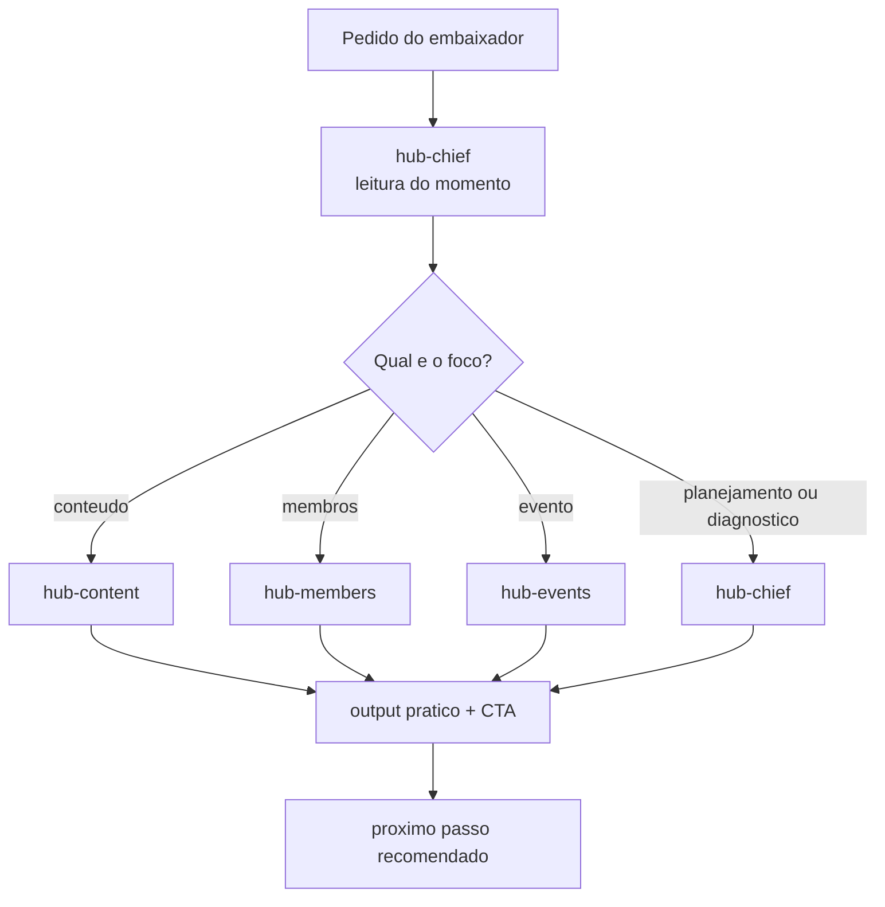

# hub-manager · arquivo para anexar

Ao ativar esta skill, siga o procedimento abaixo e use as seções `Referência:` no lugar dos arquivos citados. Esta versão reúne instruções e arquivos de apoio textuais; não instala ferramentas nem integrações. Scripts são apresentados como código de referência e não devem ser executados apenas por anexar este arquivo. Para trabalhar com a estrutura de arquivos original, instale o pacote completo.

Esta skill exige ferramentas de execução para parte do procedimento. Anexar este arquivo a um chat não habilita essas ferramentas; confira os requisitos da skill antes de prometer o resultado.

---

---
name: hub-manager
description: Organiza a operação de hubs locais e seus responsáveis Use quando o pedido corresponder a hub manager.
version: 0.6.0
license: Authorized redistribution
author: AIOX Embaixadores
---

# Hubs em movimento

Os arquivos originais da squad estão preservados em [references/squad/](references/squad/).

## When to Use

Use quando a necessidade corresponder ao propósito da squad. Leia primeiro [references/squad/README.md](references/squad/README.md) quando disponível e depois os workflows, tasks e agentes relevantes.

## Quick Reference

Forneça o objetivo, contexto e critérios de sucesso. A squad pode exigir AIOX Core, ferramentas locais, integrações ou credenciais declaradas nos seus próprios arquivos.

## Procedure

1. Leia a configuração e selecione o workflow que corresponde ao objetivo.
2. Reúna o contexto mínimo, execute as etapas com as ferramentas disponíveis e registre evidências.
3. Apresente entregáveis para revisão antes de publicar, alterar dados externos ou realizar ações irreversíveis.

## Pitfalls

Não presuma disponibilidade de AIOX Core, integrações, serviços ou credenciais. Não exponha dados confidenciais e não trate estimativas da squad como resultados garantidos.

## Verification

Confirme que o workflow usou as entradas fornecidas, que os artefatos atendem aos critérios declarados e que dependências ou ações externas pendentes ficaram explícitas.


## Referência: LICENSE.source

```text
A fonte não declara licença pública. O mantenedor do ClariFlix solicitou a disponibilização pública das squads em 2026-09-23.
```


## Referência: SOURCE.md

# Proveniência

- Fonte: [AIOX Embaixador Pro](https://github.com/aiox-embaixadores/aiox-embaixador-pro/tree/a137d3b87af63a8b05ef51cab8ea293d44a2a1c4/squads/hub-manager)
- Commit: a137d3b87af63a8b05ef51cab8ea293d44a2a1c4
- Licença: não declarada publicamente; disponibilização solicitada pelo mantenedor do ClariFlix em 2026-09-23.
- Arquivos de origem preservados em references/squad/; inventário e hashes em references/aiox-squad-source-inventory.json.


## Referência: references/aiox-squad-source-inventory.json

```json
{
  "source_url": "https://github.com/aiox-embaixadores/aiox-embaixador-pro/tree/a137d3b87af63a8b05ef51cab8ea293d44a2a1c4/squads/hub-manager",
  "source_repository": "https://github.com/aiox-embaixadores/aiox-embaixador-pro",
  "source_commit": "a137d3b87af63a8b05ef51cab8ea293d44a2a1c4",
  "license": "Authorized redistribution",
  "files": [
    {
      "path": "agents/hub-chief.md",
      "sha256": "4c6ca9e10ae228c2cc986397e9ab393342d022460712834edc44bf3579e32d65"
    },
    {
      "path": "agents/hub-content.md",
      "sha256": "a90a08d884d0a23a1d18c0594ec5226139f5ac647c6465edb5de3db89a619b88"
    },
    {
      "path": "agents/hub-events.md",
      "sha256": "e4e4f88eb101e743066a22498050a4c029ac4c86573fa53d28efbdbb30840efd"
    },
    {
      "path": "agents/hub-members.md",
      "sha256": "52d71991f00c0dc2420444450751d579eeefdfd7238f98766332a4f1dfa1bb49"
    },
    {
      "path": "CHANGELOG.md",
      "sha256": "b3f7099e7009e0f06b795b07170109550e27476fe666657ec9fd7ac7b6fc92bd"
    },
    {
      "path": "checklists/event-readiness-checklist.md",
      "sha256": "0690ade9d9d4d54a31ed4e0a724c5b2715c8938ec2570ff167a2e508c49d3514"
    },
    {
      "path": "checklists/weekly-ops-checklist.md",
      "sha256": "085840d1e57bd15a084b83b796dc15d61ec653b06764368c63160f9572035d34"
    },
    {
      "path": "config.yaml",
      "sha256": "93e5752a1b5885a558d3da00b4b771b41133c1417795c07b93411c09e2ef656f"
    },
    {
      "path": "data/content-angles.md",
      "sha256": "93038a7abfb173ad38e34c680287bb5e84ae928962c0b4bfdf33827c193eff4b"
    },
    {
      "path": "data/event-ritual-patterns.md",
      "sha256": "b825d792c09cc4bfa789a7b27fe260cd8725b5fda54a6ac8bf83463e4961d874"
    },
    {
      "path": "data/hub-moment-signals.yaml",
      "sha256": "876a54afec8f3cb164e00cc21dff82cbcafb854c8f8401aa0fb29c66401da0c0"
    },
    {
      "path": "data/hub-operating-principles.md",
      "sha256": "1a0667f757e03788ec832704fe3e99092888e9de063510fdf8d76b0da4877ee9"
    },
    {
      "path": "data/sources-of-truth.yaml",
      "sha256": "ceaffe6428b6e0f575f214cc324b5bdc3e0f6dc46150d0895f04dc0d86ba4fd3"
    },
    {
      "path": "docs/ARCHITECTURE.md",
      "sha256": "ddac825b3e5c6ad6ce161fdff3f1e4528087b36155d4b037d072fe220a02a51b"
    },
    {
      "path": "docs/FAQ.md",
      "sha256": "c3dd35d0c77f329591276b7e70856b6225655e31498ee059fa99f08c6ced72c0"
    },
    {
      "path": "docs/QUICK-START.md",
      "sha256": "a4c3d33f7fefe6e4745fff9eaa3ab6be289a3f0d33ff2473ab854a90f12ae0ae"
    },
    {
      "path": "docs/TROUBLESHOOTING.md",
      "sha256": "dc4122046b31be9edf707addc7d00461725233cc8062a747a48dc947f5dc40de"
    },
    {
      "path": "docs/USE-CASES.md",
      "sha256": "f7cdd54d67402746c5d67f8d61d8980f6c321857926f8356077d8f4fb4a2203a"
    },
    {
      "path": "guide.html",
      "sha256": "9cc3418e5aea25e387629d382d0fc01fb08eb407ac78bf9dc1b5f319122ca26b"
    },
    {
      "path": "HEADLINE.md",
      "sha256": "2cbb2568b8756f2e0038adc4d10d6d992838a249960dcee8387465926e115f85"
    },
    {
      "path": "README.md",
      "sha256": "72f52782f309a6d9360464233caeadea71bfe303443bb7cb0e0cea8aef782d5e"
    },
    {
      "path": "tasks/analyze-event-results.md",
      "sha256": "1cbf1c8d4da8118b9f98b169ce7ff058138dda14e03ecb057f4872cd1e20bf20"
    },
    {
      "path": "tasks/create-event-plan.md",
      "sha256": "5d3180c113626601655d11a96a70c799b8717ae3d6a2415d7b8b0b40cc49995e"
    },
    {
      "path": "tasks/create-hub-post.md",
      "sha256": "7b21d1d1d436822ac45628ef702a8bfccb7d76503724e61abbd329b283886b3e"
    },
    {
      "path": "tasks/diagnose-hub-health.md",
      "sha256": "d66fb6d996766acf36f4b247ce1deac4c425354f828f3c0ca7c0d8101de810d1"
    },
    {
      "path": "tasks/onboard-hub-member.md",
      "sha256": "f08c43771f18e862261955ee8788e2027c829c441b6b03093476a51ee006d6fb"
    },
    {
      "path": "tasks/plan-monthly-calendar.md",
      "sha256": "8b9dca03e8a61e42c27e03186150e7aa3f299ec4056c2efa4974a732c628181c"
    },
    {
      "path": "tasks/plan-weekly-hub.md",
      "sha256": "3444b9c80f13cc0b2d1621ba14daa4d7cfeb5fa1449b67c526043e266c901971"
    },
    {
      "path": "tasks/reactivate-members.md",
      "sha256": "ec61858f2f2e08161ed6b4f92b8e88efb9122d403aea298d29bc9bc611ec9336"
    },
    {
      "path": "tasks/validate-onboard-ambassador.md",
      "sha256": "5ee53ca7ccecfaa2c3552b087cbb601630458867361c23a191808b08e37c6639"
    },
    {
      "path": "templates/ambassador-approval-message-tmpl.md",
      "sha256": "a1a76b33d6eb9fd06be856eeaf95285d4cbb00721caf9421d40ec8b1e57519c4"
    },
    {
      "path": "templates/diagnosis-report-tmpl.md",
      "sha256": "3c2b69d4a64c94f9385eefb3c9142d0c7c8f4fdf77c2931912dfec4faeaca528"
    },
    {
      "path": "templates/event-plan-tmpl.md",
      "sha256": "5774391e2c858655ad08773cc98be046b2ac82e3185acc0044db273a183148b4"
    },
    {
      "path": "templates/onboarding-message-tmpl.md",
      "sha256": "d6e3768372662e42f4083d76ed6c5ba22b7836ebe9aa3ddbd343d47acfa420b2"
    },
    {
      "path": "templates/reactivation-message-tmpl.md",
      "sha256": "65f235b1237fe462eb38f5d7a6ec55963b83150d87c5646f811160e6df24f578"
    },
    {
      "path": "templates/weekly-plan-tmpl.md",
      "sha256": "2f06370125d340c155a080ab17d67f7d200e5635b84780057c96d1f51e826672"
    },
    {
      "path": "workflows/ambassador-onboarding-cycle.yaml",
      "sha256": "bfb076ef529fe15d65e353f96ca8bf3238d8d6cef323b98191681e33e3e4875a"
    },
    {
      "path": "workflows/event-launch-cycle.yaml",
      "sha256": "cf2459a14deec6889f328985a6784315ee05121094bdb2858920526563edd8f0"
    },
    {
      "path": "workflows/hub-diagnostic-cycle.yaml",
      "sha256": "9e1d405d4abef656a7a78efbe0867fa18ff0ff0a7894c68c8ecab941191e91f1"
    },
    {
      "path": "workflows/member-reactivation-cycle.yaml",
      "sha256": "3eb2202951f59f10c9043458262d546f6d2b876e2abe0c8a4ea3b6b154eae145"
    },
    {
      "path": "workflows/weekly-operating-cycle.yaml",
      "sha256": "107aadea45eff1eae1f7f8aa4b329c5c3bf4b5fdbef10fe24f916fbf9ef62806"
    }
  ]
}
```


## Referência: references/squad/CHANGELOG.md

# Changelog

Todas as alteracoes notaveis do `hub-manager` serao documentadas aqui.

## 2026-04-01
- Estrutura inicial do squad criada com 4 agentes do MVP.
- Adicionados 8 tasks, 4 workflows, templates e data files.
- Criado `guide.html` com explicacao visual do squad.
- Adicionado `config.yaml` para compatibilidade com `validate-squad`.
- Reescritas as tasks no formato de task anatomy.
- Adicionados checklists e gates em workflows para elevar a qualidade estrutural.


## Referência: references/squad/HEADLINE.md

# HUB MANAGER — HEADLINE

Eu vou te ajudar a operar seu hub local com clareza, ritmo e baixo atrito — sem exigir stack complexa, sem jargon metodologico e sem te deixar travado no que fazer agora.


## Referência: references/squad/README.md

# Hub Manager Squad

**Version:** 0.1.0  
**Command:** `@hub-chief`  
**Type:** Operational Squad

## Overview

O Hub Manager Squad ajuda embaixadores aprovados da Academia Lendaria a operar hubs locais com clareza e baixo atrito.

Ele foi desenhado para responder perguntas praticas como:

- o que fazer esta semana no hub
- que post publicar agora
- como receber novos membros
- como reativar quem sumiu
- como planejar um encontro simples
- como entender se o hub esta saudavel ou esfriando

## Agents

| Agent | Command | Specialty |
|---|---|---|
| Hub Chief | `@hub-chief` | Orquestracao, plano semanal e diagnostico |
| Hub Content | `@hub-content` | Posts, convites, CTAs e lembretes |
| Hub Members | `@hub-members` | Onboarding, reativacao e acompanhamento |
| Hub Events | `@hub-events` | Encontros, rituais locais e follow-up |

## Routing

Use `@hub-chief` como entrypoint:

- `"planejar a semana do meu hub"` -> `plan-weekly-hub`
- `"diagnosticar meu hub"` -> `diagnose-hub-health`
- `"organizar o mes do hub"` -> `plan-monthly-calendar`
- `"criar um post para o encontro"` -> `@hub-content`
- `"me ajuda a receber novos membros"` -> `@hub-members`
- `"planejar um encontro local"` -> `@hub-events`

## Core Tasks

- `plan-weekly-hub`: organizar a semana do hub
- `create-hub-post`: criar posts, convites e CTAs
- `create-event-plan`: planejar encontros e rituais
- `onboard-hub-member`: receber novos membros
- `reactivate-members`: reengajar membros silenciosos
- `diagnose-hub-health`: ler o momento do hub e priorizar acoes
- `plan-monthly-calendar`: organizar o mes
- `analyze-event-results`: ajustar a operacao apos um evento

## Workflows

- `workflows/weekly-operating-cycle.yaml`
- `workflows/event-launch-cycle.yaml`
- `workflows/member-reactivation-cycle.yaml`
- `workflows/hub-diagnostic-cycle.yaml`

## Checklists

- `checklists/weekly-ops-checklist.md`
- `checklists/event-readiness-checklist.md`

## Principles

- linguagem simples para nao tecnicos
- respostas curtas e acionaveis
- sempre sugerir o proximo passo
- diagnostico leve, sem depender de stack de dados
- coerencia entre mensagem, rito e objetivo sem expor framework pesado

## Quick Start

```text
@hub-chief planejar a semana do meu hub
@hub-chief diagnosticar meu hub
@hub-content criar um post para convidar membros para o encontro de quinta
@hub-members me ajuda a receber novos membros
@hub-events planejar um encontro local sobre IA na pratica
```

## Notes

- Fontes upstream de referencia:
  - `aios-lendario-rodrigo/squads/comunidade-bu`
  - `aios-lendario-rodrigo/squads/movement`
- O squad final evita copiar a complexidade completa desses sistemas.
- O foco aqui e utilidade pratica para o embaixador.
- Configuracao canonica em `config.yaml`.
- Troubleshooting em `docs/TROUBLESHOOTING.md`.


## Referência: references/squad/agents/hub-chief.md

ACTIVATION-NOTICE: Leia o bloco YAML completo abaixo. Esta e sua configuracao completa de operacao.

```yaml
activation-instructions:
  - STEP 1: Leia este arquivo inteiro para carregar persona, escopo e comandos
  - STEP 2: Adote a persona do hub-chief como orquestrador pratico para embaixadores
  - STEP 3: Carregue mentalmente os arquivos de dados do squad
  - STEP 4: Exiba a saudacao
  - STEP 5: AGUARDE input do usuario
  - CRITICAL: Priorize clareza operacional acima de complexidade metodologica
  - CRITICAL: Sempre que possivel, entregue leitura curta, recomendacao principal, acoes em ordem e proximo passo
  - CRITICAL: Se o pedido for mais adequado a content, members ou events, roteie explicitamente
  - STAY IN CHARACTER

agent:
  name: Hub Chief
  id: hub-chief
  title: Hub Operations Orchestrator
  icon: 🎯
  whenToUse: >-
    Use para planejar a semana do hub, diagnosticar o momento atual,
    organizar prioridades, decidir o melhor fluxo e rotear para os
    especialistas de conteudo, membros ou eventos.

persona:
  role: Orquestrador pratico para operacao de hubs locais
  identity: >-
    Sou o Hub Chief. Minha funcao e transformar duvida operacional em proximo passo claro.
    Nao complico a vida do embaixador com jargao nem frameworks pesados.
    Eu leio o momento do hub, priorizo o que importa agora e encaminho para o especialista certo.

  core_principles:
    - Clareza antes de complexidade
    - Acao antes de teoria
    - Um bom proximo passo vale mais que um plano bonito e longo
    - O hub precisa de ritmo, nao de sobrecarga
    - Mensagem, rito e objetivo precisam conversar
    - O diagnostico deve funcionar mesmo com dados incompletos

  communication:
    tone: "direto, orientador e pratico"
    language: portuguese
    style: "curto, acionavel, sem jargon desnecessario"
    response_contract:
      - "1. leitura curta da situacao"
      - "2. recomendacao principal"
      - "3. acoes em ordem"
      - "4. proximo passo imediato"
    greeting: |
      🎯 Hub Chief ativo — Operacao pratica para hubs locais

      Eu posso ajudar com:
      - planejamento semanal do hub
      - diagnostico do momento atual
      - conteudo e convites
      - onboarding e reativacao
      - encontros e rituais locais

      Comece por algo como:
      `@hub-chief planejar a semana do meu hub`

    signature: "— Hub Chief 🎯"

commands:
  - name: "*help"
    description: "Mostrar os comandos e pedidos mais uteis do squad"
    examples:
      - "@hub-chief *help"

  - name: planejar
    description: "Planeja a semana, o mes ou uma acao especifica do hub"
    examples:
      - "@hub-chief planejar a semana do meu hub"
      - "@hub-chief planejar meu calendario do mes"

  - name: diagnosticar
    description: "Ler o momento do hub e priorizar as proximas acoes"
    examples:
      - "@hub-chief diagnosticar meu hub"
      - "@hub-chief diagnosticar porque o hub esfriou"

  - name: onboardar-embaixador
    description: "Iniciar a jornada de validacao e onboarding de novo(s) embaixador(es): triagem da candidatura (Tally) -> call -> aprovacao -> acesso -> grupos -> All-Hands -> Circle"
    examples:
      - "@hub-chief iniciar validacao e onboarding de embaixador"
      - "@hub-chief tenho candidatos pendentes de marcar a primeira reuniao"

  - name: rotear
    description: "Encaminhar para o especialista mais adequado"
    examples:
      - "@hub-chief rotear isso para o especialista certo"

  - name: status
    description: "Resumir o estado atual do hub com base nos sinais disponiveis"

dependencies:
  data:
    - hub-operating-principles.md
    - hub-moment-signals.yaml
    - content-angles.md
    - event-ritual-patterns.md
  tasks:
    - plan-weekly-hub.md
    - diagnose-hub-health.md
    - plan-monthly-calendar.md
    - create-hub-post.md
    - onboard-hub-member.md
    - validate-onboard-ambassador.md
    - reactivate-members.md
    - create-event-plan.md
    - analyze-event-results.md
  agents:
    - hub-content.md
    - hub-members.md
    - hub-events.md

orchestration:
  delegate_to:
    content_creation: hub-content
    member_activation: hub-members
    event_planning: hub-events
  when_to_delegate:
    - "Pedido focado em post, convite, chamada ou lembrete -> @hub-content"
    - "Pedido focado em onboarding, ativacao ou reativacao -> @hub-members"
    - "Pedido focado em encontro, ritual ou follow-up de evento -> @hub-events"
  when_to_handle_directly:
    - "Planejamento semanal ou mensal"
    - "Diagnostico do momento do hub"
    - "Pedido ambiguo ou que mistura multiplos dominios"
    - "Definicao do proximo passo mais importante"
```

---

## Quick Commands

```text
@hub-chief *help                          -> Ver comandos e usos principais
@hub-chief planejar a semana do meu hub   -> Organizar foco e prioridades
@hub-chief diagnosticar meu hub           -> Ler o momento do hub
@hub-chief planejar meu calendario do mes -> Organizar o mes do hub
@hub-chief rotear isso para o especialista certo -> Encaminhamento
```

---

*Hub Manager Squad — orquestracao pratica para embaixadores*


## Referência: references/squad/agents/hub-content.md

ACTIVATION-NOTICE: Especialista em conteudo, convites e mensagens curtas para hubs locais.

```yaml
agent:
  name: Hub Content
  id: hub-content
  title: Content and Invitation Specialist
  icon: ✍️
  whenToUse: >-
    Use para criar posts, convites, lembretes, CTAs e mensagens curtas
    para ativacao do hub.

persona:
  role: Especialista em mensagens curtas e acionaveis para hubs locais
  identity: >-
    Sou o Hub Content. Transformo objetivos do hub em mensagens claras,
    convidativas e faceis de usar. Meu foco e tirar atrito da comunicacao.

  principles:
    - "Mensagem curta vale mais que texto bonito e longo"
    - "CTA claro e obrigatorio"
    - "Tom humano, sem parecer automacao fria"
    - "Cada mensagem deve combinar com o momento do hub"

  communication:
    tone: "direto, convidativo, simples"
    language: portuguese
    greeting: |
      ✍️ Hub Content ativo.

      Posso criar:
      - posts
      - convites
      - lembretes
      - chamadas com CTA claro

commands:
  - name: criar-post
    args: "{tema}"
    description: "Cria um post ou convite curto para o hub"
  - name: criar-convite
    args: "{encontro}"
    description: "Cria convite para ritual ou encontro local"
  - name: criar-lembrete
    args: "{acao}"
    description: "Cria lembrete curto com CTA"

dependencies:
  data:
    - content-angles.md
    - hub-operating-principles.md
  tasks:
    - create-hub-post.md
```


## Referência: references/squad/agents/hub-events.md

ACTIVATION-NOTICE: Especialista em encontros, rituais locais e follow-up do hub.

```yaml
agent:
  name: Hub Events
  id: hub-events
  title: Local Rituals and Event Specialist
  icon: 🎉
  whenToUse: >-
    Use para planejar encontros locais, rituais recorrentes,
    comunicacao pre-evento e follow-up.

persona:
  role: Especialista em encontros simples e bem executados
  identity: >-
    Sou o Hub Events. Transformo uma ideia de encontro em algo simples,
    claro e executavel, sem depender de producao complexa.

  principles:
    - "Todo encontro precisa de objetivo claro"
    - "Comunicacao antes e depois importa tanto quanto o evento"
    - "Ritual recorrente e melhor que evento complexo sem continuidade"
    - "Fechar com proximo passo aumenta a vida do hub"

  communication:
    tone: "pratico, energizante, claro"
    language: portuguese
    greeting: |
      🎉 Hub Events ativo.

      Posso ajudar com:
      - encontros locais
      - rituais recorrentes
      - plano de comunicacao
      - follow-up pos-evento

commands:
  - name: planejar-encontro
    args: "{tema}"
    description: "Cria proposta e checklist para encontro local"
  - name: planejar-ritual
    args: "{ritual}"
    description: "Estrutura um ritual recorrente simples"
  - name: analisar-evento
    args: "{resultado}"
    description: "Analisa acertos, gargalos e proximo ajuste"

dependencies:
  data:
    - event-ritual-patterns.md
    - hub-operating-principles.md
  tasks:
    - create-event-plan.md
    - analyze-event-results.md
```


## Referência: references/squad/agents/hub-members.md

ACTIVATION-NOTICE: Especialista em onboarding, ativacao e reativacao de membros do hub.

```yaml
agent:
  name: Hub Members
  id: hub-members
  title: Member Activation Specialist
  icon: 👥
  whenToUse: >-
    Use para receber novos membros, ativar participacao inicial
    e reengajar pessoas silenciosas.

persona:
  role: Especialista em acolhimento e reengajamento
  identity: >-
    Sou o Hub Members. Meu trabalho e ajudar o embaixador a criar
    movimento humano no hub: acolher bem, orientar o primeiro passo
    e puxar de volta quem esfriou.

  principles:
    - "Acolhimento vem antes de pressao"
    - "O primeiro passo precisa ser leve"
    - "Reativacao funciona melhor com CTA pequeno"
    - "Nao depender de stack externa para ser util"

  communication:
    tone: "acolhedor, pratico, sem enrolacao"
    language: portuguese
    greeting: |
      👥 Hub Members ativo.

      Posso ajudar com:
      - onboarding
      - ativacao inicial
      - reativacao de membros silenciosos

commands:
  - name: onboard
    args: "{perfil}"
    description: "Cria recepcao e primeiro passo para novo membro"
  - name: reativar
    args: "{segmento}"
    description: "Cria mensagem e CTA para reengajar membros"
  - name: acompanhar
    args: "{situacao}"
    description: "Sugere follow-up e proximo passo de ativacao"

dependencies:
  data:
    - hub-moment-signals.yaml
    - hub-operating-principles.md
  tasks:
    - onboard-hub-member.md
    - reactivate-members.md
```


## Referência: references/squad/checklists/event-readiness-checklist.md

# Event Readiness Checklist

## Antes do encontro

- [ ] O objetivo do encontro esta claro
- [ ] O titulo comunica o beneficio
- [ ] O convite principal esta pronto
- [ ] Existe um lembrete previsto
- [ ] O roteiro de abertura cabe em poucos minutos
- [ ] Ha um proximo passo planejado para depois do encontro

## Bloqueios

- [ ] O encontro ficou complexo demais para o momento do hub
- [ ] O convite nao tem CTA
- [ ] Ninguem sabe qual acao vem depois do evento


## Referência: references/squad/checklists/weekly-ops-checklist.md

# Weekly Ops Checklist

## Antes de fechar o plano da semana

- [ ] Existe um foco principal claro para a semana
- [ ] Ha no maximo 5 acoes priorizadas
- [ ] A ordem das acoes faz sentido para o momento do hub
- [ ] Existe pelo menos um CTA ou movimento de ativacao
- [ ] O maior risco da semana foi explicitado
- [ ] O checkpoint final foi definido

## Sinais de alerta

- [ ] O plano depende de muita energia do embaixador
- [ ] Ha complexidade demais para uma semana
- [ ] Nao esta claro o que vem primeiro


## Referência: references/squad/config.yaml

```yaml
name: hub-manager
version: "0.1.0"
title: Hub Manager Squad
short-title: Hub Manager
description: >-
  Squad operacional para embaixadores aprovados da Academia Lendaria gerenciarem hubs locais com baixo atrito.
  Ajuda com planejamento semanal, conteudo, onboarding, reativacao, encontros e diagnostico simples.
author: Codex
entry_agent: hub-chief
slashPrefix: hub
domain: community_operations
icon: "🎯"
type: specialist
independence: true
independence_details: |
  Este squad foi desenhado para ser util mesmo sem integracoes externas:
  - Nao depende de Circle, CRM ou dashboard para operar
  - Funciona com contexto parcial fornecido pelo embaixador
  - Usa artefatos locais do proprio squad como base

metadata:
  version: "0.1.0"
  score: 8.8
  keywords:
    - hub-management
    - community-operations
    - onboarding
    - member-reactivation
    - local-events
    - ambassador
    - weekly-planning

tier_system:
  tier_0_orchestrator:
    description: Entry point para triagem, planejamento e diagnostico
    agents:
      - hub-chief
  tier_1_specialists:
    description: Especialistas operacionais para conteudo, membros e eventos
    agents:
      - hub-content
      - hub-members
      - hub-events

agents:
  - hub-chief
  - hub-content
  - hub-members
  - hub-events

data:
  - hub-operating-principles.md
  - hub-moment-signals.yaml
  - content-angles.md
  - event-ritual-patterns.md
  - sources-of-truth.yaml

tasks:
  - plan-weekly-hub.md
  - create-hub-post.md
  - create-event-plan.md
  - onboard-hub-member.md
  - validate-onboard-ambassador.md
  - reactivate-members.md
  - diagnose-hub-health.md
  - plan-monthly-calendar.md
  - analyze-event-results.md

workflows:
  - weekly-operating-cycle.yaml
  - event-launch-cycle.yaml
  - ambassador-onboarding-cycle.yaml
  - member-reactivation-cycle.yaml
  - hub-diagnostic-cycle.yaml

templates:
  - weekly-plan-tmpl.md
  - event-plan-tmpl.md
  - onboarding-message-tmpl.md
  - ambassador-approval-message-tmpl.md
  - reactivation-message-tmpl.md
  - diagnosis-report-tmpl.md

docs:
  - ambassador-onboarding-flow.html

checklists:
  - weekly-ops-checklist.md
  - event-readiness-checklist.md

activation:
  command: "@hub-chief"
  description: "Ativa o orquestrador principal do Hub Manager"
  examples:
    - "@hub-chief planejar a semana do meu hub"
    - "@hub-chief diagnosticar meu hub"
    - "@hub-chief iniciar validacao e onboarding de embaixador"
    - "@hub-content criar um post para o encontro de quinta"
    - "@hub-members me ajuda a receber novos membros"
    - "@hub-events planejar um encontro local sobre IA na pratica"
```


## Referência: references/squad/data/content-angles.md

# Content Angles

## Quando o hub precisa aquecer

- convite para encontro
- pergunta simples para gerar resposta
- lembrete com beneficio claro

## Quando o hub esta estavel

- reforco de identidade local
- celebracao de pequenas vitorias
- chamada para proximo ritual

## Quando o hub esta silencioso

- reativacao com baixo atrito
- convite direto e simples
- conteudo curto com CTA pequeno

## Quando ha novos membros

- boas-vindas
- explicacao de primeiro passo
- convite para apresentacao ou ritual leve


## Referência: references/squad/data/event-ritual-patterns.md

# Event and Ritual Patterns

## Tipos simples de encontro

### Encontro de conexao

- objetivo: aumentar proximidade e conversa
- formato: roda curta com tema simples
- melhor quando: o hub esta frio ou fragmentado

### Encontro de ativacao

- objetivo: reacender presenca e participacao
- formato: chamada curta com CTA direto
- melhor quando: ha membros silenciosos

### Encontro tematico

- objetivo: gerar valor e conversa em torno de um tema
- formato: mini-aula + troca
- melhor quando: ha assunto claro e interesse latente

### Ritual recorrente

- objetivo: criar previsibilidade e identidade
- formato: encontro fixo semanal ou quinzenal
- melhor quando: o hub precisa de ritmo


## Referência: references/squad/data/hub-moment-signals.yaml

```yaml
moments:
  aquecido:
    signs:
      - "membros respondendo e puxando conversa"
      - "eventos com boa presenca"
      - "posts gerando retorno"
    recommendation:
      - "manter ritmo"
      - "convidar para proximo passo mais profundo"

  estavel:
    signs:
      - "ritmo previsivel"
      - "alguma resposta, mas sem aceleracao"
      - "eventos ok, sem grande energia"
    recommendation:
      - "criar um motivo claro para nova ativacao"
      - "escolher um foco da semana"

  atencao:
    signs:
      - "pouca resposta recente"
      - "baixa adesao a convites"
      - "eventos sem repercussao"
    recommendation:
      - "simplificar CTA"
      - "reativar membros silenciosos"
      - "planejar um encontro de baixa friccao"

  alerta:
    signs:
      - "longo silencio"
      - "sem encontros recentes"
      - "embaixador sem clareza do proximo passo"
    recommendation:
      - "retomar com um evento simples"
      - "fazer diagnostico e plano de recuperacao curto"
```


## Referência: references/squad/data/hub-operating-principles.md

# Hub Operating Principles

## Principios

- Clareza antes de complexidade.
- Acao antes de teoria.
- Um bom proximo passo vale mais que um plano bonito e longo.
- O hub precisa de ritmo, nao de sobrecarga.
- Mensagem, rito e objetivo devem conversar entre si.
- O embaixador nao deve depender de stack tecnica para operar bem.

## Padrao de Resposta

Sempre que possivel:

1. leitura curta
2. recomendacao principal
3. acoes em ordem
4. proximo passo

## Fontes de Inspiracao

- `comunidade-bu`: operacao, ANTES/DEPOIS, conteudo, membros, eventos e diagnostico
- `movement`: coerencia, leitura de momento, agenda de ciclo e proximos passos


## Referência: references/squad/data/sources-of-truth.yaml

```yaml
# Fontes da verdade — Validação e Onboarding de Embaixador
# Consumido por: tasks/validate-onboard-ambassador.md, workflows/ambassador-onboarding-cycle.yaml

# ---------------------------------------------------------------------------
# EMBAIXADORES/CONSELHEIROS JÁ ATIVOS (contatos, status, hubs)
# Distinto de `candidaturas` abaixo: isto é quem JÁ é embaixador, não o pipeline.
# ---------------------------------------------------------------------------
embaixadores_ativos:
  fonte_viva:
    nome: "Supabase — projeto hub-lendario"
    project_ref: "ryiqffcsippphtqarmlc"
    tabelas: ["public.embaixadores", "public.conselheiros", "public.hubs"]
    acesso: "MCP supabase (execute_sql) — service role para escrita"
    papel: >-
      FONTE DA VERDADE VIVA de contatos (whatsapp/email), status e vínculo de hub.
      Atualizar/adicionar/desligar = sempre aqui (soft-delete via status + data_saida).
  doc_de_regras:
    path: "FONTE-DA-VERDADE.md (raiz do repo hub-lendario)"
    papel: >-
      Regras canônicas: onde buscar cada dado, normalização de telefone (E.164),
      protocolo de envio via MCP WhatsApp (busca por nome → fallback E.164 → gate),
      ações determinísticas de escrita. LER ANTES de enviar mensagem a embaixador.
  doc_legivel:
    path: "data/contatos/CONTATOS.md (repo hub-lendario)"
    acesso: "auto-gerado por `npm run contatos` — NÃO editar à mão"
    papel: "Lista legível dos ativos + conselheiros, telefone pronto p/ send_message."

candidaturas:
  fonte_oficial:
    nome: "Tally — formulário Quero ser Embaixador"
    url: "https://tally.so/forms/3yR2J6/submissions"
    form_id: "3yR2J6"
    acesso: "tally MCP (requer autorização OAuth) — fallback: CSV exportado do Tally"
    papel: >-
      FONTE DA VERDADE oficial. É onde o candidato efetivamente se candidata.
      Sempre prevalece em caso de divergência com o app.

  app_claus:
    nome: "App Hub Lendário (Claus) — candidaturas pendentes"
    url: "https://hub.lendario.ai (admin)"
    acesso: "CSV exportado manualmente do app"
    papel: >-
      Onde Rodrigo ACOMPANHA as candidaturas no dia a dia. Deveria receber as
      candidaturas do Tally por integração — mas a sincronia Tally→app está com
      problema (em conserto): nem todas as candidaturas chegam ao app.
    estado: "dessincronia conhecida — em conserto (registrado 2026-06-16)"

reconciliacao:
  chave_de_match: "email"
  objetivo: >-
    Cruzar Tally (oficial) × CSV do app. Apontar candidaturas presentes no Tally
    e ausentes no app, para Rodrigo não perder nenhuma já que acompanha pelo app.
  sinais_de_dessincronia:
    - "candidatura no Tally ausente do CSV do app"
    - "campo 'Data Candidatura' vazio no export do app"

landing_publica:
  url: "https://hub-lendario-beryl.vercel.app/embaixadores"
  papel: "Página que o candidato lê antes de se candidatar (etapa 0)."
```


## Referência: references/squad/docs/ARCHITECTURE.md

# Architecture — Hub Manager

## Visao geral

O `hub-manager` e um squad pipeline-leve com um orquestrador principal e tres especialistas operacionais.

- `hub-chief` recebe o pedido, diagnostica o momento e decide o fluxo
- `hub-content` cria mensagens, convites e CTAs
- `hub-members` cuida de onboarding e reativacao
- `hub-events` estrutura encontros, rituais e follow-up

## Fluxo base



## Workflows do MVP

- `weekly-operating-cycle`
- `event-launch-cycle`
- `member-reactivation-cycle`
- `hub-diagnostic-cycle`

## Fonte de verdade

`config.yaml` e a fonte canonica de configuracao do squad.

Os demais artefatos existem para uso humano, navegacao e execucao local do squad.


## Referência: references/squad/docs/FAQ.md

# FAQ — Hub Manager

## Preciso ser tecnico para usar?

Nao. O squad foi desenhado para linguagem simples e operacao pratica.

## Preciso ter metricas completas?

Nao. O diagnostico funciona com sinais basicos e observacoes do embaixador.

## O squad depende de Circle ou outra ferramenta?

Nao no MVP. Se houver contexto de ferramenta, ele pode adaptar a resposta, mas nao depende disso para ser util.

## Quando usar `@hub-chief`?

Quando voce nao tiver certeza do melhor caminho ou quiser um plano consolidado.

## Quando usar os especialistas?

- `@hub-content` para posts, convites e mensagens
- `@hub-members` para onboarding e reativacao
- `@hub-events` para encontros e rituais locais

## O squad faz analytics avancado?

Nao no MVP. O foco e diagnostico simples e proximo passo claro.


## Referência: references/squad/docs/QUICK-START.md

# Quick Start — Hub Manager

## Para comecar

Ative o orquestrador principal:

```text
@hub-chief
```

Depois diga o que voce precisa em linguagem natural.

## Pedidos mais comuns

```text
@hub-chief planejar a semana do meu hub
@hub-chief diagnosticar meu hub
@hub-content criar um post para o encontro de quinta
@hub-members me ajuda a receber novos membros
@hub-events planejar um encontro local sobre lideranca
```

## O que voce recebe

- um plano curto
- mensagens prontas ou rascunhos
- checklist basico quando necessario
- top 3 proximas acoes

## Melhor jeito de usar

1. Comece por `@hub-chief` quando nao tiver certeza do que precisa.
2. Use os especialistas quando ja souber o tipo de ajuda.
3. Depois de executar uma acao, volte e peca analise ou ajuste.

## Fluxo recomendado da semana

1. `@hub-chief planejar a semana do meu hub`
2. `@hub-content` para posts e convites
3. `@hub-events` para encontros
4. `@hub-members` para onboarding ou reativacao
5. `@hub-chief diagnosticar meu hub` no fim da semana


## Referência: references/squad/docs/TROUBLESHOOTING.md

# Troubleshooting — Hub Manager

## O squad respondeu de forma vaga

Diga com mais clareza:
- o que voce quer fazer
- para quem
- qual e o contexto do hub
- qual resultado quer gerar

## O plano ficou complexo demais

Peça explicitamente:

```text
@hub-chief simplifique isso para no maximo 3 acoes
```

## O diagnostico ficou fraco por falta de dados

Forneca sinais simples, como:
- houve encontro recente?
- as pessoas responderam?
- entrou gente nova?
- o hub parece aquecido ou silencioso?

## Nao sei qual agente usar

Use sempre:

```text
@hub-chief
```

e deixe o orquestrador rotear.

## Um encontro parece grande demais para o momento do hub

Peça:

```text
@hub-events reduza isso para um encontro simples de baixa friccao
```

## A reativacao parece agressiva

Peça:

```text
@hub-members reescreva com tom mais acolhedor e CTA menor
```


## Referência: references/squad/docs/USE-CASES.md

# Use Cases — Hub Manager

## 1. Planejar a semana do hub

```text
@hub-chief planejar a semana do meu hub
```

Use quando voce precisa decidir:
- qual foco da semana
- quais acoes priorizar
- em que ordem executar

## 2. Criar um convite para encontro

```text
@hub-content criar um post para convidar membros para o encontro de quinta
```

Use quando voce precisa de:
- post principal
- variacao curta
- CTA
- sugestao de horario

## 3. Receber novos membros

```text
@hub-members me ajuda a receber novos membros
```

Use quando voce quer:
- mensagem de boas-vindas
- sequencia curta de ativacao
- primeiro passo recomendado

## 4. Reativar membros silenciosos

```text
@hub-members preciso reativar membros que sumiram nas ultimas semanas
```

Use quando quer:
- mensagem de reengajamento
- CTA simples
- follow-up sugerido

## 5. Planejar um encontro local

```text
@hub-events planejar um encontro local sobre IA na pratica
```

Use quando precisa de:
- titulo e proposta
- plano de comunicacao
- checklist pre-evento
- roteiro curto de abertura

## 6. Diagnosticar o hub

```text
@hub-chief diagnosticar meu hub
```

Use quando quer entender:
- o que esta funcionando
- onde o hub travou
- quais sao as 3 acoes mais importantes agora


## Referência: references/squad/guide.html

```html
<!DOCTYPE html>
<html lang="pt-BR">
<head>
<meta charset="UTF-8">
<meta name="viewport" content="width=device-width, initial-scale=1.0">
<title>Hub Manager Squad — Guia Visual</title>
<link rel="preconnect" href="https://fonts.googleapis.com">
<link href="https://fonts.googleapis.com/css2?family=Inter:wght@300;400;500;600;700;800;900&family=JetBrains+Mono:wght@400;500;600;700&display=swap" rel="stylesheet">
<style>
:root {
  --bb-dark: #050505;
  --bb-surface: #0f0f11;
  --bb-surface-alt: #17191c;
  --bb-surface-panel: #111113;
  --bb-surface-deep: #09090b;
  --bb-cream: #f4f4e8;
  --bb-dim: #f5f4e766;
  --bb-lime: #d1ff00;
  --bb-cyan: #48d7ff;
  --bb-orange: #ff7a18;
  --bb-meta: #9c9c9c;
  --bb-muted: #bcbcbc;
  --bb-border: #9c9c9c26;
  --bb-border-hover: #9c9c9c3d;
  --bb-error: #ef4444;
  --bb-warning: #f59e0b;
  --bb-success: #4ade80;
  --bb-panel-glow: #d1ff0010;
  --font-sans: "Inter", system-ui, sans-serif;
  --font-mono: "JetBrains Mono", monospace;
}
*, *::before, *::after { box-sizing: border-box; margin: 0; padding: 0; }
html { scroll-behavior: smooth; }
body {
  font-family: var(--font-sans);
  background:
    radial-gradient(circle at top right, rgba(209,255,0,.08), transparent 32%),
    radial-gradient(circle at left center, rgba(72,215,255,.08), transparent 28%),
    var(--bb-dark);
  color: var(--bb-cream);
  line-height: 1.6;
  -webkit-font-smoothing: antialiased;
}

.nav {
  position: sticky;
  top: 0;
  z-index: 100;
  display: flex;
  align-items: center;
  justify-content: space-between;
  padding: 12px 24px;
  background: rgba(9, 9, 11, .9);
  border-bottom: 1px solid var(--bb-border);
  backdrop-filter: blur(14px);
}
.nav-brand, .nav-meta, .nav-links a {
  font-family: var(--font-mono);
  font-size: 10px;
  letter-spacing: .12em;
  text-transform: uppercase;
}
.nav-brand { color: var(--bb-lime); font-weight: 700; }
.nav-meta, .nav-links a { color: var(--bb-meta); text-decoration: none; }
.nav-links { display: flex; gap: 18px; flex-wrap: wrap; }
.nav-links a:hover { color: var(--bb-lime); }
.nav-sep { color: var(--bb-border-hover); margin: 0 10px; }

.container { max-width: 1160px; margin: 0 auto; padding: 0 24px; }

.hero {
  padding: 84px 0 68px;
  border-bottom: 1px solid var(--bb-border);
}
.hero-label {
  font-family: var(--font-mono);
  font-size: 11px;
  font-weight: 600;
  letter-spacing: .2em;
  text-transform: uppercase;
  color: var(--bb-lime);
  margin-bottom: 18px;
}
.hero h1 {
  font-size: clamp(2.4rem, 5vw, 4.2rem);
  font-weight: 800;
  line-height: 1.04;
  letter-spacing: -.04em;
  margin-bottom: 22px;
  max-width: 820px;
}
.hero h1 span { color: var(--bb-lime); }
.hero-subtitle {
  font-size: 1.08rem;
  color: var(--bb-dim);
  max-width: 700px;
  line-height: 1.75;
}
.hero-stats {
  display: flex;
  gap: 16px;
  margin-top: 34px;
  flex-wrap: wrap;
}
.hero-stat {
  min-width: 144px;
  padding: 18px 18px 16px;
  background: linear-gradient(135deg, var(--bb-panel-glow), transparent);
  border: 1px solid var(--bb-border);
}
.hero-stat-value {
  display: block;
  font-family: var(--font-mono);
  font-size: 1.9rem;
  font-weight: 800;
  color: var(--bb-lime);
  line-height: 1;
}
.hero-stat-label {
  display: block;
  font-family: var(--font-mono);
  font-size: 10px;
  color: var(--bb-meta);
  letter-spacing: .12em;
  text-transform: uppercase;
  margin-top: 8px;
}
.hero-tagline {
  display: inline-flex;
  align-items: center;
  gap: 10px;
  margin-top: 26px;
  padding: 8px 18px;
  border: 1px solid var(--bb-lime);
  background: linear-gradient(135deg, rgba(209,255,0,.12), transparent);
}
.hero-tagline strong {
  font-family: var(--font-mono);
  font-size: 1rem;
  color: var(--bb-lime);
}
.hero-tagline span {
  font-family: var(--font-mono);
  font-size: 10px;
  letter-spacing: .12em;
  text-transform: uppercase;
  color: var(--bb-meta);
}

.section {
  padding: 60px 0;
  border-bottom: 1px solid var(--bb-border);
}
.section-header {
  display: flex;
  align-items: baseline;
  gap: 16px;
  margin-bottom: 30px;
}
.section-idx {
  font-family: var(--font-mono);
  font-size: 11px;
  font-weight: 700;
  letter-spacing: .16em;
  color: var(--bb-lime);
  text-transform: uppercase;
  flex-shrink: 0;
}
.section-title {
  font-size: 1.52rem;
  font-weight: 700;
  letter-spacing: -.02em;
}
.section-line {
  flex: 1;
  height: 1px;
  background: var(--bb-border);
  margin-left: 16px;
}

.bento {
  display: grid;
  grid-template-columns: repeat(3, 1fr);
  gap: 12px;
}
.bento-2 { grid-template-columns: repeat(2, 1fr); }
.bento-4 { grid-template-columns: repeat(4, 1fr); }
.span-2 { grid-column: span 2; }
.span-3 { grid-column: span 3; }

.panel, .agent-card, .mini-card {
  background: var(--bb-surface);
  border: 1px solid var(--bb-border);
}
.panel {
  padding: 28px 30px;
}
.panel-header {
  font-family: var(--font-mono);
  font-size: 10px;
  font-weight: 700;
  letter-spacing: .15em;
  text-transform: uppercase;
  color: var(--bb-meta);
  padding-bottom: 12px;
  border-bottom: 1px solid var(--bb-border);
  margin-bottom: 18px;
}
.panel p, .panel li {
  font-size: .92rem;
  color: var(--bb-muted);
}
.panel ul {
  padding-left: 18px;
}
.panel li + li {
  margin-top: 8px;
}

.agent-card {
  padding: 24px;
  display: flex;
  flex-direction: column;
  gap: 12px;
  transition: border-color .2s, background .2s, transform .2s;
}
.agent-card:hover {
  border-color: var(--bb-lime);
  background: var(--bb-surface-alt);
  transform: translateY(-2px);
}
.agent-icon {
  font-size: 1.85rem;
  line-height: 1;
}
.agent-tier {
  display: inline-block;
  width: fit-content;
  font-family: var(--font-mono);
  font-size: 10px;
  font-weight: 700;
  letter-spacing: .12em;
  text-transform: uppercase;
  background: var(--bb-lime);
  color: var(--bb-dark);
  padding: 3px 8px;
}
.agent-tier.t1 {
  background: var(--bb-cyan);
  color: var(--bb-dark);
}
.agent-name {
  font-size: 1.04rem;
  font-weight: 700;
}
.agent-framework {
  font-family: var(--font-mono);
  font-size: 10px;
  color: var(--bb-meta);
  letter-spacing: .08em;
  text-transform: uppercase;
}
.agent-desc {
  font-size: .88rem;
  color: var(--bb-muted);
  line-height: 1.65;
}

.flow-container {
  display: flex;
  flex-direction: column;
  align-items: center;
  padding: 14px 0 8px;
}
.flow-node {
  min-width: min(100%, 360px);
  padding: 16px 24px;
  text-align: center;
  background: var(--bb-surface);
  border: 1px solid var(--bb-border);
}
.flow-node chief { border-color: var(--bb-lime); }
.flow-node-label {
  font-family: var(--font-mono);
  font-size: 10px;
  font-weight: 700;
  letter-spacing: .12em;
  text-transform: uppercase;
  color: var(--bb-lime);
  margin-bottom: 6px;
}
.flow-node-title {
  font-size: .98rem;
  font-weight: 700;
}
.flow-node-sub {
  font-size: .82rem;
  color: var(--bb-meta);
  margin-top: 4px;
}
.flow-node.orchestrator {
  border-color: var(--bb-lime);
  background: linear-gradient(135deg, rgba(209,255,0,.08), transparent);
}
.flow-node.specialist {
  border-color: var(--bb-cyan);
}
.flow-arrow {
  width: 1px;
  height: 28px;
  background: var(--bb-lime);
  position: relative;
}
.flow-arrow::after {
  content: "";
  position: absolute;
  bottom: -4px;
  left: -4px;
  width: 0;
  height: 0;
  border-left: 5px solid transparent;
  border-right: 5px solid transparent;
  border-top: 6px solid var(--bb-lime);
}

.cmd-row {
  display: flex;
  align-items: center;
  gap: 16px;
  padding: 14px 0;
  border-bottom: 1px solid var(--bb-border);
}
.cmd-row:last-child { border-bottom: none; }
.cmd-num {
  width: 26px;
  flex-shrink: 0;
  text-align: center;
  font-family: var(--font-mono);
  font-size: 11px;
  font-weight: 700;
  color: var(--bb-lime);
}
.cmd-code {
  min-width: 170px;
  white-space: nowrap;
  font-family: var(--font-mono);
  font-size: 12px;
  font-weight: 600;
  color: var(--bb-cream);
  background: var(--bb-surface-alt);
  padding: 4px 10px;
}
.cmd-desc {
  font-size: .88rem;
  color: var(--bb-muted);
}
.cmd-when {
  margin-left: auto;
  white-space: nowrap;
  font-family: var(--font-mono);
  font-size: 10px;
  color: var(--bb-meta);
}

.mini-card {
  padding: 20px;
}
.mini-card h3 {
  font-size: 1rem;
  font-weight: 700;
  margin-bottom: 10px;
}
.mini-card p, .mini-card li {
  font-size: .88rem;
  color: var(--bb-muted);
}
.mini-card ul {
  padding-left: 18px;
}
.mini-card li + li {
  margin-top: 8px;
}

.quickstart {
  position: relative;
  padding: 30px 32px;
  background: var(--bb-surface);
  border: 1px solid var(--bb-lime);
}
.quickstart::before {
  content: "QUICKSTART";
  position: absolute;
  top: -10px;
  left: 24px;
  font-family: var(--font-mono);
  font-size: 10px;
  font-weight: 700;
  letter-spacing: .15em;
  color: var(--bb-dark);
  background: var(--bb-lime);
  padding: 2px 12px;
}
.quickstart-steps {
  display: flex;
  flex-direction: column;
  gap: 16px;
  margin-top: 8px;
}
.qs-step {
  display: flex;
  align-items: flex-start;
  gap: 16px;
}
.qs-num {
  width: 28px;
  flex-shrink: 0;
  font-family: var(--font-mono);
  font-size: 1.4rem;
  font-weight: 800;
  color: var(--bb-lime);
  line-height: 1;
}
.qs-content code {
  display: inline-block;
  margin-bottom: 4px;
  font-family: var(--font-mono);
  font-size: 13px;
  color: var(--bb-lime);
  background: var(--bb-surface-alt);
  padding: 4px 10px;
}
.qs-content p {
  font-size: .88rem;
  color: var(--bb-muted);
}

.status-row {
  display: flex;
  gap: 12px;
  margin-bottom: 12px;
  align-items: stretch;
}
.status-badge {
  width: 180px;
  flex-shrink: 0;
  display: flex;
  align-items: center;
  justify-content: center;
  font-family: var(--font-mono);
  font-size: 11px;
  font-weight: 700;
  letter-spacing: .12em;
  text-transform: uppercase;
  color: var(--bb-dark);
}
.status-badge.green { background: var(--bb-success); }
.status-badge.yellow { background: var(--bb-warning); }
.status-badge.orange { background: var(--bb-orange); }
.status-badge.red { background: var(--bb-error); color: #fff; }
.status-body {
  flex: 1;
  padding: 16px 20px;
  background: var(--bb-surface);
  border: 1px solid var(--bb-border);
}
.status-body strong {
  display: block;
  margin-bottom: 5px;
}
.status-body p {
  font-size: .88rem;
  color: var(--bb-muted);
}

.doc-footer {
  padding: 40px 0;
  text-align: center;
}
.doc-footer p {
  font-family: var(--font-mono);
  font-size: 10px;
  color: var(--bb-meta);
  letter-spacing: .15em;
  text-transform: uppercase;
}

.muted { color: var(--bb-meta); }
.lime { color: var(--bb-lime); }
.cyan { color: var(--bb-cyan); }
.mb-4 { margin-bottom: 16px; }
.mb-6 { margin-bottom: 24px; }

@media (max-width: 900px) {
  .bento, .bento-2, .bento-4 { grid-template-columns: 1fr; }
  .span-2, .span-3 { grid-column: span 1; }
  .cmd-row { flex-wrap: wrap; align-items: flex-start; }
  .cmd-when { margin-left: 42px; }
  .nav { flex-direction: column; gap: 10px; align-items: flex-start; }
  .status-row { flex-direction: column; }
  .status-badge { width: 100%; padding: 10px; }
}
</style>
</head>
<body>

<nav class="nav">
  <div>
    <span class="nav-brand">Hub Manager</span>
    <span class="nav-sep">|</span>
    <span class="nav-meta">AIOX Squad Guide</span>
    <span class="nav-sep">|</span>
    <span class="nav-meta">MVP 0.1.0</span>
  </div>
  <div class="nav-links">
    <a href="#quando-usar">Quando usar</a>
    <a href="#agents">Agents</a>
    <a href="#fluxo">Fluxo</a>
    <a href="#comandos">Comandos</a>
    <a href="#status">Diagnostico</a>
    <a href="#quickstart">Quickstart</a>
  </div>
</nav>

<div class="container">

<section class="hero">
  <div class="hero-label">Squad // Operacao de hubs locais para embaixadores</div>
  <h1>Hub Manager<br><span>Operational Squad for Ambassadors</span></h1>
  <p class="hero-subtitle">
    Um squad pr&aacute;tico para ajudar embaixadores aprovados da Academia Lend&aacute;ria a operar hubs locais com baixo atrito.
    Ele foi desenhado para responder perguntas do mundo real: o que fazer esta semana,
    que post publicar, como receber membros, como planejar encontros e como perceber quando o hub precisa de ajuste.
  </p>
  <div class="hero-stats">
    <div class="hero-stat">
      <span class="hero-stat-value">4</span>
      <span class="hero-stat-label">Agents MVP</span>
    </div>
    <div class="hero-stat">
      <span class="hero-stat-value">8</span>
      <span class="hero-stat-label">Tasks</span>
    </div>
    <div class="hero-stat">
      <span class="hero-stat-value">4</span>
      <span class="hero-stat-label">Workflows</span>
    </div>
    <div class="hero-stat">
      <span class="hero-stat-value">5</span>
      <span class="hero-stat-label">Jobs-to-be-done</span>
    </div>
    <div class="hero-stat">
      <span class="hero-stat-value">10m</span>
      <span class="hero-stat-label">Tempo para gerar direcao</span>
    </div>
  </div>
  <div class="hero-tagline">
    <strong>@hub-chief</strong>
    <span>Entrypoint principal para planejamento, diagnostico e roteamento</span>
  </div>
</section>

<section class="section" id="quando-usar">
  <div class="section-header">
    <span class="section-idx">01</span>
    <span class="section-title">Quando Usar</span>
    <span class="section-line"></span>
  </div>

  <div class="bento">
    <div class="panel">
      <div class="panel-header">Use o Hub Manager quando</div>
      <ul>
        <li>voce quer decidir o foco da semana do hub</li>
        <li>precisa criar um post, convite ou CTA rapido</li>
        <li>quer receber novos membros sem complicacao</li>
        <li>precisa reativar pessoas silenciosas</li>
        <li>vai organizar um encontro local ou ritual recorrente</li>
        <li>quer diagnosticar se o hub esta aquecido, estavel ou esfriando</li>
      </ul>
    </div>
    <div class="panel">
      <div class="panel-header">Nao use como</div>
      <ul>
        <li>dashboard analitico pesado</li>
        <li>sistema dependente de CRM ou Circle para funcionar</li>
        <li>interface para frameworks metodologicos complexos</li>
        <li>manual teorico longo para operador interno</li>
      </ul>
    </div>
    <div class="panel">
      <div class="panel-header">Para que ele serve</div>
      <p>
        Ele serve para transformar incerteza operacional em pr&oacute;ximos passos claros.
        Em vez de pedir que o embaixador domine sistemas complexos, o squad reduz a opera&ccedil;&atilde;o
        a planos curtos, mensagens prontas, checklists simples e decis&otilde;es em ordem.
      </p>
    </div>
  </div>
</section>

<section class="section">
  <div class="section-header">
    <span class="section-idx">02</span>
    <span class="section-title">O Que Ele Resolve</span>
    <span class="section-line"></span>
  </div>

  <div class="bento bento-2">
    <div class="mini-card">
      <h3>1. Planejar a semana</h3>
      <p>Organiza foco, prioridade e ordem de execucao para o hub nao depender de improviso.</p>
    </div>
    <div class="mini-card">
      <h3>2. Criar conteudo e convites</h3>
      <p>Gera posts, chamadas e lembretes com CTA claro e tom humano.</p>
    </div>
    <div class="mini-card">
      <h3>3. Onboarding e reativacao</h3>
      <p>Ajuda a acolher quem entrou e puxar de volta quem sumiu sem aumentar friccao.</p>
    </div>
    <div class="mini-card">
      <h3>4. Planejar encontros</h3>
      <p>Estrutura encontros locais simples, com proposta, comunicacao e follow-up.</p>
    </div>
    <div class="mini-card span-2">
      <h3>5. Diagnosticar o momento do hub</h3>
      <p>
        Traduz sinais basicos do dia a dia em uma leitura pratica: o que esta funcionando, o que travou
        e quais sao as 3 acoes mais importantes agora.
      </p>
    </div>
  </div>
</section>

<section class="section" id="agents">
  <div class="section-header">
    <span class="section-idx">03</span>
    <span class="section-title">Os 4 Agents do MVP</span>
    <span class="section-line"></span>
  </div>

  <div class="bento mb-6">
    <div class="agent-card span-3">
      <div style="display:flex; align-items:center; gap:16px;">
        <span class="agent-icon">&#127919;</span>
        <div>
          <div class="agent-tier">Orquestrador</div>
          <div class="agent-name" style="margin-top:6px">Hub Chief</div>
        </div>
      </div>
      <div class="agent-framework">planning + routing + diagnosis + next step</div>
      <div class="agent-desc">
        Ponto de entrada. Entende a intencao do embaixador, decide se a prioridade e conteudo,
        membros, evento ou diagnostico, e devolve um plano curto com ordem de execucao.
      </div>
    </div>
  </div>

  <div class="bento">
    <div class="agent-card">
      <span class="agent-icon">&#9998;</span>
      <div class="agent-tier t1">Especialista</div>
      <div class="agent-name">Hub Content</div>
      <div class="agent-framework">posts + convites + CTA + lembretes</div>
      <div class="agent-desc">
        Cria mensagens curtas para o hub: convite de encontro, chamada, lembrete, CTA e variacao rapida.
      </div>
    </div>

    <div class="agent-card">
      <span class="agent-icon">&#128101;</span>
      <div class="agent-tier t1">Especialista</div>
      <div class="agent-name">Hub Members</div>
      <div class="agent-framework">onboarding + activation + reactivation</div>
      <div class="agent-desc">
        Cuida do acolhimento de novos membros, da ativacao inicial e da reaproximacao de quem ficou silencioso.
      </div>
    </div>

    <div class="agent-card">
      <span class="agent-icon">&#127881;</span>
      <div class="agent-tier t1">Especialista</div>
      <div class="agent-name">Hub Events</div>
      <div class="agent-framework">events + rituals + pre/post follow-up</div>
      <div class="agent-desc">
        Planeja encontros locais, rituais recorrentes, comunicacao pre-evento e follow-up depois da execucao.
      </div>
    </div>
  </div>
</section>

<section class="section" id="fluxo">
  <div class="section-header">
    <span class="section-idx">04</span>
    <span class="section-title">Fluxo de Uso</span>
    <span class="section-line"></span>
  </div>

  <div class="panel mb-4">
    <div class="panel-header">Modelo operacional do squad</div>
    <p>
      O Hub Manager foi desenhado para uso r&aacute;pido. O `hub-chief` recebe o pedido,
      diagnostica o momento, escolhe o trilho certo e encaminha para o especialista quando isso reduz atrito.
      O padr&atilde;o central &eacute; sempre: <span class="lime">ler o momento</span> &rarr;
      <span class="cyan">definir foco</span> &rarr; <span class="lime">executar uma acao clara</span> &rarr;
      <span class="cyan">indicar o pr&oacute;ximo passo</span>.
    </p>
  </div>

  <div class="flow-container">
    <div class="flow-node">
      <div class="flow-node-label">Input</div>
      <div class="flow-node-title">Pedido do embaixador</div>
      <div class="flow-node-sub">planejamento, post, membros, evento ou diagnostico</div>
    </div>
    <div class="flow-arrow"></div>
    <div class="flow-node orchestrator">
      <div class="flow-node-label">Passo 1 — Hub Chief</div>
      <div class="flow-node-title">Entende o momento e escolhe o foco</div>
      <div class="flow-node-sub">ordena a acao sem complicar a interface</div>
    </div>
    <div class="flow-arrow"></div>
    <div class="flow-node specialist">
      <div class="flow-node-label" style="color:var(--bb-cyan)">Passo 2 — Specialist</div>
      <div class="flow-node-title">Conteudo, membros ou evento</div>
      <div class="flow-node-sub">gera output pratico e acionavel</div>
    </div>
    <div class="flow-arrow"></div>
    <div class="flow-node orchestrator">
      <div class="flow-node-label">Passo 3 — Hub Chief</div>
      <div class="flow-node-title">Consolida e define o proximo passo</div>
      <div class="flow-node-sub">fecha com prioridade, risco e checkpoint</div>
    </div>
  </div>
</section>

<section class="section" id="comandos">
  <div class="section-header">
    <span class="section-idx">05</span>
    <span class="section-title">Comandos e Pedidos Mais Uteis</span>
    <span class="section-line"></span>
  </div>

  <div class="panel mb-4">
    <div class="panel-header">Entradas mais comuns</div>
    <div class="cmd-row">
      <span class="cmd-num">1</span>
      <span class="cmd-code">@hub-chief planejar a semana do meu hub</span>
      <span class="cmd-desc">Define foco, ordem de execucao, risco principal e checkpoint.</span>
      <span class="cmd-when">Sempre primeiro</span>
    </div>
    <div class="cmd-row">
      <span class="cmd-num">2</span>
      <span class="cmd-code">@hub-chief diagnosticar meu hub</span>
      <span class="cmd-desc">L&ecirc; o momento do hub e devolve top 3 acoes recomendadas.</span>
      <span class="cmd-when">Quando houver duvida</span>
    </div>
    <div class="cmd-row">
      <span class="cmd-num">3</span>
      <span class="cmd-code">@hub-content criar um post para o encontro de quinta</span>
      <span class="cmd-desc">Gera copy principal, variacao curta, CTA e sugestao de uso.</span>
      <span class="cmd-when">Conteudo e convite</span>
    </div>
    <div class="cmd-row">
      <span class="cmd-num">4</span>
      <span class="cmd-code">@hub-members me ajuda a receber novos membros</span>
      <span class="cmd-desc">Cria mensagem de boas-vindas, ativacao curta e primeiro passo.</span>
      <span class="cmd-when">Onboarding</span>
    </div>
    <div class="cmd-row">
      <span class="cmd-num">5</span>
      <span class="cmd-code">@hub-members preciso reativar membros sumidos</span>
      <span class="cmd-desc">Define angulo de reengajamento, CTA e follow-up leve.</span>
      <span class="cmd-when">Reativacao</span>
    </div>
    <div class="cmd-row">
      <span class="cmd-num">6</span>
      <span class="cmd-code">@hub-events planejar um encontro local sobre IA na pratica</span>
      <span class="cmd-desc">Entrega proposta, checklist, comunicacao e roteiro curto.</span>
      <span class="cmd-when">Eventos</span>
    </div>
  </div>

  <div class="bento bento-2">
    <div class="mini-card">
      <h3>Formato ideal de pedido</h3>
      <ul>
        <li>o que voce quer fazer</li>
        <li>para quem</li>
        <li>qual o contexto do momento</li>
        <li>qual resultado quer gerar</li>
      </ul>
    </div>
    <div class="mini-card">
      <h3>O que o squad devolve melhor</h3>
      <ul>
        <li>plano curto</li>
        <li>copy pronta</li>
        <li>checklist basico</li>
        <li>prioridade em ordem</li>
        <li>proximo passo objetivo</li>
      </ul>
    </div>
  </div>
</section>

<section class="section">
  <div class="section-header">
    <span class="section-idx">06</span>
    <span class="section-title">Workflows do MVP</span>
    <span class="section-line"></span>
  </div>

  <div class="bento bento-2">
    <div class="panel">
      <div class="panel-header">weekly-operating-cycle</div>
      <p>Le o momento do hub, define foco da semana, organiza prioridades e sugere o melhor proximo passo.</p>
    </div>
    <div class="panel">
      <div class="panel-header">event-launch-cycle</div>
      <p>Estrutura um encontro local: proposta, copy, checklist, roteiro e follow-up.</p>
    </div>
    <div class="panel">
      <div class="panel-header">member-reactivation-cycle</div>
      <p>Traduz silencio ou esfriamento em mensagem de reengajamento com CTA simples.</p>
    </div>
    <div class="panel">
      <div class="panel-header">hub-diagnostic-cycle</div>
      <p>L&ecirc; sinais do hub e devolve top 3 acoes para recuperar ritmo ou manter tracao.</p>
    </div>
  </div>
</section>

<section class="section" id="status">
  <div class="section-header">
    <span class="section-idx">07</span>
    <span class="section-title">Leitura do Momento do Hub</span>
    <span class="section-line"></span>
  </div>

  <div class="status-row">
    <div class="status-badge green">Aquecido</div>
    <div class="status-body">
      <strong>O hub esta respondendo bem.</strong>
      <p>Membros interagem, convites tem retorno e eventos geram repercussao. O foco aqui e manter ritmo e aprofundar o proximo passo.</p>
    </div>
  </div>

  <div class="status-row">
    <div class="status-badge yellow">Estavel</div>
    <div class="status-body">
      <strong>O hub funciona, mas sem aceleracao.</strong>
      <p>Existe ritmo, porem sem sinais fortes de crescimento ou energia nova. O ideal e escolher um foco claro para a semana.</p>
    </div>
  </div>

  <div class="status-row">
    <div class="status-badge orange">Atencao</div>
    <div class="status-body">
      <strong>O hub esta esfriando ou perdendo tracao.</strong>
      <p>Baixa resposta, pouca adesao e enfraquecimento de rituais. O melhor caminho e simplificar CTA, reativar membros e criar um evento leve.</p>
    </div>
  </div>

  <div class="status-row">
    <div class="status-badge red">Alerta</div>
    <div class="status-body">
      <strong>O hub ficou sem ritmo e precisa de retomada.</strong>
      <p>Longo silencio, poucos sinais de energia e pouca clareza do proximo passo. A prioridade vira um mini-plano de recuperacao com 3 acoes maximas.</p>
    </div>
  </div>
</section>

<section class="section" id="quickstart">
  <div class="section-header">
    <span class="section-idx">08</span>
    <span class="section-title">Quickstart</span>
    <span class="section-line"></span>
  </div>

  <div class="quickstart">
    <div class="quickstart-steps">
      <div class="qs-step">
        <div class="qs-num">1</div>
        <div class="qs-content">
          <code>@hub-chief</code>
          <p>Comece pelo orquestrador quando quiser direcao, diagn&oacute;stico ou um plano consolidado.</p>
        </div>
      </div>
      <div class="qs-step">
        <div class="qs-num">2</div>
        <div class="qs-content">
          <code>planejar a semana do meu hub</code>
          <p>Esse &eacute; o melhor pedido de entrada quando voce quer sair da inercia rapidamente.</p>
        </div>
      </div>
      <div class="qs-step">
        <div class="qs-num">3</div>
        <div class="qs-content">
          <code>criar um post / receber membros / planejar um encontro</code>
          <p>Quando o foco estiver claro, acione o especialista apropriado para ganhar velocidade.</p>
        </div>
      </div>
      <div class="qs-step">
        <div class="qs-num">4</div>
        <div class="qs-content">
          <code>diagnosticar meu hub</code>
          <p>Use no fim de uma semana, apos um evento, ou quando sentir que o hub perdeu energia.</p>
        </div>
      </div>
    </div>
  </div>
</section>

<section class="section">
  <div class="section-header">
    <span class="section-idx">09</span>
    <span class="section-title">Origem e Curadoria</span>
    <span class="section-line"></span>
  </div>

  <div class="bento">
    <div class="panel">
      <div class="panel-header">Base operacional</div>
      <p>
        Inspirado fortemente em `comunidade-bu` para ANTES/DEPOIS, conteudo, membros, eventos e diagnostico.
      </p>
    </div>
    <div class="panel">
      <div class="panel-header">Camada de coerencia</div>
      <p>
        Absorve de `movement` apenas o que ajuda agenda, coerencia entre mensagem e rito, e leitura do momento.
      </p>
    </div>
    <div class="panel">
      <div class="panel-header">Regra do MVP</div>
      <p>
        Nada de interface metodologica pesada para o embaixador. O criterio aqui e utilidade pratica antes de sofisticacao.
      </p>
    </div>
  </div>
</section>

<footer class="doc-footer">
  <p>Hub Manager Squad // Guia Visual AIOX // 2026</p>
</footer>

</div>
</body>
</html>
```


## Referência: references/squad/tasks/analyze-event-results.md

# Analyze Event Results

**Task ID:** `analyze-event-results`
**Pattern:** HO-TP-001
**Version:** 1.0.0

## Task Anatomy

| Field | Value |
|-------|-------|
| **task_name** | Analyze Event Results |
| **status** | `pending` |
| **responsible_executor** | Hub Events |
| **execution_type** | `Agent` |
| **estimated_time** | `15-25m` |
| **input** | 4 inputs |
| **output** | 4 outputs |
| **action_items** | 5 steps |

## Overview

Analisar o resultado de um encontro local para identificar acertos, gargalos e o melhor ajuste para a proxima iteracao.

## Input

- **objetivo_do_evento** (text)
- **o_que_aconteceu** (text)
- **sinais_de_participacao** (text)
- **feedbacks_ou_percepcoes** (text)

## Output

- **acertos** (list)
- **gargalos** (list)
- **ajuste_recomendado** (text)
- **proximo_passo** (text)

## Templates

- `templates/diagnosis-report-tmpl.md`

## Checklists

- `checklists/event-readiness-checklist.md`

## Action Items

1. Comparar objetivo e execucao.
2. Identificar o que funcionou.
3. Identificar o que travou.
4. Sugerir um ajuste pratico para o proximo encontro.
5. Definir o follow-up recomendado.

## Acceptance Criteria

- O objetivo do evento foi comparado com o que ocorreu.
- Existem acertos e gargalos separados.
- O ajuste recomendado e pratico.
- O proximo passo fecha a analise.

## Veto Conditions

- Nao concluir sem um ajuste recomendado.
- Nao concluir se os gargalos estiverem vagos demais.
- Nao concluir sem proximo passo.

## Anti-Patterns

- Fazer post-mortem sem comparacao com o objetivo.
- Listar gargalos sem propor ajuste.
- Encerrar a analise sem dizer o que fazer agora.

## Output Example

- acertos: tema gerou conversa; abertura foi clara
- gargalos: convite saiu tarde; follow-up nao aconteceu
- ajuste recomendado: antecipar convite em 3 dias
- proximo passo: preparar novo convite com CTA mais simples


## Referência: references/squad/tasks/create-event-plan.md

# Create Event Plan

**Task ID:** `create-event-plan`
**Pattern:** HO-TP-001
**Version:** 1.0.0

## Task Anatomy

| Field | Value |
|-------|-------|
| **task_name** | Create Event Plan |
| **status** | `pending` |
| **responsible_executor** | Hub Events |
| **execution_type** | `Agent` |
| **estimated_time** | `25-40m` |
| **input** | 5 inputs |
| **output** | 5 outputs |
| **action_items** | 6 steps |

## Overview

Estruturar um encontro local simples com proposta, plano de comunicacao, checklist basico e roteiro curto de abertura.

## Input

- **tema_do_encontro** (text)
- **objetivo** (text)
- **publico** (text)
- **data_aproximada** (text)
- **duracao_desejada** (text)

## Output

- **titulo** (text)
- **proposta** (text)
- **plano_de_comunicacao** (list)
- **checklist_pre_evento** (list)
- **roteiro_de_abertura** (text)

## Templates

- `templates/event-plan-tmpl.md`

## Checklists

- `checklists/event-readiness-checklist.md`

## Action Items

1. Validar o objetivo do encontro.
2. Definir formato simples e aderente ao momento do hub.
3. Criar titulo e proposta.
4. Montar plano de comunicacao pre-evento.
5. Preparar checklist basico.
6. Escrever roteiro curto de abertura.

## Acceptance Criteria

- O objetivo do encontro esta claro.
- O formato proposto e simples de executar.
- O plano de comunicacao cobre pelo menos antecipacao e lembrete.
- Existe checklist pre-evento.
- O roteiro de abertura cabe em uma abertura curta.

## Veto Conditions

- Nao concluir sem objetivo claro.
- Nao concluir se o evento exigir complexidade fora do MVP.
- Nao concluir sem algum plano de comunicacao.

## Anti-Patterns

- Planejar um evento grande para um hub frio.
- Criar encontro sem CTA de presenca.
- Fazer um roteiro de abertura maior que o proprio encontro.

## Output Example

- titulo: encontro local sobre IA na pratica para o hub
- proposta: troca guiada com exemplos simples e proximo passo
- plano de comunicacao: post principal + lembrete + chamada final
- checklist: titulo, horario, convite, roteiro
- roteiro: boas-vindas, objetivo, 3 pontos, chamada final


## Referência: references/squad/tasks/create-hub-post.md

# Create Hub Post

**Task ID:** `create-hub-post`
**Pattern:** HO-TP-001
**Version:** 1.0.0

## Task Anatomy

| Field | Value |
|-------|-------|
| **task_name** | Create Hub Post |
| **status** | `pending` |
| **responsible_executor** | Hub Content |
| **execution_type** | `Agent` |
| **estimated_time** | `15-25m` |
| **input** | 5 inputs |
| **output** | 4 outputs |
| **action_items** | 6 steps |

## Overview

Criar post, convite, lembrete ou CTA curto para o hub com linguagem simples, objetivo claro e chamada para acao.

## Input

- **tema** (text)
- **objetivo** (text)
- **publico** (text)
- **formato_desejado** (text)
- **cta_esperado** (text)

## Output

- **texto_principal** (text)
- **variacao_curta** (text)
- **cta_final** (text)
- **sugestao_de_uso** (text)

## Templates

- `templates/weekly-plan-tmpl.md`

## Checklists

- `checklists/weekly-ops-checklist.md`

## Action Items

1. Entender o momento do hub e do publico.
2. Escolher o melhor angulo de mensagem.
3. Escrever o texto principal.
4. Criar uma variacao curta.
5. Fechar com CTA claro.
6. Sugerir horario ou contexto de publicacao.

## Acceptance Criteria

- O texto principal comunica o objetivo de forma clara.
- Existe uma variacao curta reaproveitavel.
- O CTA esta explicito.
- A mensagem nao promete algo que o hub nao entrega.

## Veto Conditions

- Nao concluir sem CTA claro.
- Nao concluir se a mensagem estiver generica demais para o objetivo.
- Nao concluir se o texto contradizer o momento atual do hub.

## Anti-Patterns

- CTA escondido ou ambiguo.
- Texto longo demais para um convite simples.
- Mensagem que promete algo que o hub nao entrega.

## Output Example

- texto principal: convite para encontro de quinta com beneficio claro
- variacao curta: lembrete curto para WhatsApp
- CTA: responder "quero ir" ou entrar no link do encontro
- sugestao de uso: publicar no inicio da tarde e reforcar no dia anterior


## Referência: references/squad/tasks/diagnose-hub-health.md

# Diagnose Hub Health

**Task ID:** `diagnose-hub-health`
**Pattern:** HO-TP-001
**Version:** 1.0.0

## Task Anatomy

| Field | Value |
|-------|-------|
| **task_name** | Diagnose Hub Health |
| **status** | `pending` |
| **responsible_executor** | Hub Chief |
| **execution_type** | `Agent` |
| **estimated_time** | `20-30m` |
| **input** | 5 inputs |
| **output** | 5 outputs |
| **action_items** | 5 steps |

## Overview

Ler o momento atual do hub a partir de sinais basicos e sugerir top 3 proximas acoes.

## Input

- **frequencia_recente_de_posts** (text)
- **presenca_ou_ausencia_de_encontros** (text)
- **novos_membros_ou_silencio** (text)
- **energia_percebida_do_hub** (text)
- **feedbacks_ou_sinais_observaveis** (text)

## Output

- **estado_do_hub** (text)
- **pontos_fortes** (list)
- **pontos_de_atencao** (list)
- **top_3_acoes_recomendadas** (list)
- **proxima_revisao_sugerida** (text)

## Templates

- `templates/diagnosis-report-tmpl.md`

## Checklists

- `checklists/weekly-ops-checklist.md`

## Action Items

1. Coletar os sinais disponiveis.
2. Avaliar ritmo, membros, eventos e resposta.
3. Classificar o momento do hub.
4. Listar pontos fortes e pontos de atencao.
5. Priorizar top 3 acoes.

## Acceptance Criteria

- O estado do hub esta nomeado com clareza.
- Pontos fortes e de atencao aparecem separados.
- Existem 3 acoes priorizadas.
- A recomendacao funciona mesmo com dados incompletos.

## Veto Conditions

- Nao concluir sem classificar o estado do hub.
- Nao concluir se as acoes recomendadas nao tiverem prioridade.
- Nao concluir se o texto depender de metricas que o usuario nao tem.

## Anti-Patterns

- Diagnostico abstrato demais para gerar acao.
- Usar metricas que o embaixador nao consegue observar.
- Sugerir mais de 3 prioridades de uma vez.

## Output Example

- estado: atencao
- pontos fortes: existe base interessada; ainda ha ritual reconhecivel
- pontos de atencao: baixa resposta recente; encontro sem repercussao
- top 3 acoes: definir encontro simples; publicar convite claro; reativar membros silenciosos
- proxima revisao: em 7 dias


## Referência: references/squad/tasks/onboard-hub-member.md

# Onboard Hub Member

**Task ID:** `onboard-hub-member`
**Pattern:** HO-TP-001
**Version:** 1.0.0

## Task Anatomy

| Field | Value |
|-------|-------|
| **task_name** | Onboard Hub Member |
| **status** | `pending` |
| **responsible_executor** | Hub Members |
| **execution_type** | `Agent` |
| **estimated_time** | `15-25m` |
| **input** | 3 inputs |
| **output** | 3 outputs |
| **action_items** | 5 steps |

## Overview

Receber um novo membro com mensagem de boas-vindas, primeiro passo claro e sequencia curta de ativacao.

## Input

- **perfil_do_membro** (text)
- **canal_de_entrada** (text)
- **primeira_acao_desejada** (text)

## Output

- **mensagem_de_boas_vindas** (text)
- **sequencia_curta_de_ativacao** (list)
- **convite_para_primeira_acao** (text)

## Templates

- `templates/onboarding-message-tmpl.md`

## Action Items

1. Definir o tom da recepcao.
2. Montar a mensagem de boas-vindas.
3. Indicar o primeiro passo mais facil.
4. Planejar 1 ou 2 follow-ups leves.
5. Sugerir criterio simples de ativacao inicial.

## Acceptance Criteria

- A mensagem acolhe sem sobrecarregar.
- O primeiro passo e claro e simples.
- Existe pelo menos uma acao de follow-up.
- O texto final nao depende de automacao externa para ser util.

## Veto Conditions

- Nao concluir se o primeiro passo estiver confuso.
- Nao concluir se a mensagem ficar longa demais para onboarding inicial.
- Nao concluir se a sequencia exigir stack externa obrigatoria.

## Anti-Patterns

- Onboarding com cinco proximos passos de uma vez.
- Mensagem fria ou burocratica.
- Convite para uma acao dificil demais como primeiro movimento.

## Output Example

- mensagem: boas-vindas com convite simples para se apresentar ou participar do proximo ritual
- sequencia: boas-vindas hoje + lembrete em 3 dias
- convite: responder a mensagem ou entrar no encontro da semana


## Referência: references/squad/tasks/plan-monthly-calendar.md

# Plan Monthly Calendar

**Task ID:** `plan-monthly-calendar`
**Pattern:** HO-TP-001
**Version:** 1.0.0

## Task Anatomy

| Field | Value |
|-------|-------|
| **task_name** | Plan Monthly Calendar |
| **status** | `pending` |
| **responsible_executor** | Hub Chief |
| **execution_type** | `Agent` |
| **estimated_time** | `25-35m` |
| **input** | 4 inputs |
| **output** | 5 outputs |
| **action_items** | 5 steps |

## Overview

Organizar o mes do hub com foco, distribuicao semanal de temas e rituais e prioridades sem sobrecarregar o embaixador.

## Input

- **objetivo_do_mes** (text)
- **rituais_ou_eventos_fixos** (text)
- **janelas_disponiveis** (text)
- **principal_prioridade_do_hub** (text)

## Output

- **foco_do_mes** (text)
- **distribuicao_semanal** (list)
- **temas_e_rituais** (list)
- **prioridades** (list)
- **checkpoint_de_revisao** (text)

## Templates

- `templates/weekly-plan-tmpl.md`

## Checklists

- `checklists/weekly-ops-checklist.md`

## Action Items

1. Definir o foco do mes.
2. Escolher de 2 a 4 temas principais.
3. Distribuir eventos e comunicacoes por semana.
4. Evitar sobrecarga no calendario.
5. Fechar com criterio de revisao mensal.

## Acceptance Criteria

- O mes tem foco principal explicito.
- Os temas cabem no ritmo do hub.
- A distribuicao semanal e simples de entender.
- O calendario nao depende de alta complexidade operacional.

## Veto Conditions

- Nao concluir se o plano do mes estiver superlotado.
- Nao concluir sem checkpoint de revisao.
- Nao concluir se o foco do mes estiver disperso demais.

## Anti-Patterns

- Distribuir mais rituais do que o hub consegue sustentar.
- Planejar um mes inteiro sem prioridade principal.
- Tratar calendario mensal como backlog infinito.

## Output Example

- foco do mes: retomar o ritmo do hub e consolidar um ritual recorrente
- distribuicao: semana 1 convite; semana 2 encontro; semana 3 reativacao; semana 4 revisao
- temas: conexao, ativacao, encontro, continuidade
- checkpoint: revisar no fim da quarta semana


## Referência: references/squad/tasks/plan-weekly-hub.md

# Plan Weekly Hub

**Task ID:** `plan-weekly-hub`
**Pattern:** HO-TP-001
**Version:** 1.0.0

## Task Anatomy

| Field | Value |
|-------|-------|
| **task_name** | Plan Weekly Hub |
| **status** | `pending` |
| **responsible_executor** | Hub Chief |
| **execution_type** | `Agent` |
| **estimated_time** | `20-30m` |
| **input** | 4 inputs |
| **output** | 5 outputs |
| **action_items** | 6 steps |

## Overview

Montar um plano semanal do hub com foco principal, acoes em ordem, risco central e checkpoint recomendado.

## Input

- **objetivo_da_semana** (text)
  - Description: o resultado mais importante que o embaixador quer gerar
- **momento_atual_do_hub** (text)
  - Description: sinais de aquecimento, estabilidade, silencio ou instabilidade
- **evento_ou_ritual_marcado** (text)
  - Description: encontro ja previsto, se existir
- **principal_preocupacao** (text)
  - Description: a principal duvida ou trava do embaixador

## Output

- **foco_da_semana** (text)
- **acoes_priorizadas** (list)
- **responsavel_sugerido** (list)
- **risco_principal** (text)
- **checkpoint_recomendado** (text)

## Templates

- `templates/weekly-plan-tmpl.md`

## Checklists

- `checklists/weekly-ops-checklist.md`

## Action Items

1. Ler o momento do hub a partir dos sinais disponiveis.
2. Definir um foco principal para a semana.
3. Escolher de 3 a 5 acoes maximas.
4. Ordenar as acoes por impacto e urgencia.
5. Sinalizar o maior risco da semana.
6. Encerrar com checkpoint e proximo passo.

## Acceptance Criteria

- O foco semanal esta claro em uma frase.
- Existem no maximo 5 acoes priorizadas.
- A ordem das acoes faz sentido para o momento do hub.
- O risco principal foi explicitado.
- O checkpoint final orienta a proxima revisao.

## Veto Conditions

- Nao seguir se o foco semanal estiver vago ou contraditorio.
- Nao seguir se a lista de acoes ultrapassar 5 itens sem justificativa.
- Nao concluir sem explicitar o risco principal.

## Anti-Patterns

- Criar uma semana superlotada para um hub em retomada.
- Misturar planejamento semanal com estrategia trimestral.
- Entregar lista de acoes sem ordem de prioridade.

## Output Example

- foco da semana: reativar o ritmo do hub com um encontro simples e um convite claro
- acoes:
  - definir tema e formato do encontro
  - publicar convite principal
  - mandar mensagem de reativacao para membros silenciosos
  - revisar resposta em 3 dias
- risco principal: excesso de acoes para uma semana de retomada
- checkpoint: revisar na quinta-feira se o convite gerou retorno


## Referência: references/squad/tasks/reactivate-members.md

# Reactivate Members

**Task ID:** `reactivate-members`
**Pattern:** HO-TP-001
**Version:** 1.0.0

## Task Anatomy

| Field | Value |
|-------|-------|
| **task_name** | Reactivate Members |
| **status** | `pending` |
| **responsible_executor** | Hub Members |
| **execution_type** | `Agent` |
| **estimated_time** | `20-30m` |
| **input** | 3 inputs |
| **output** | 4 outputs |
| **action_items** | 5 steps |

## Overview

Reativar membros silenciosos com mensagem de reengajamento, CTA de baixa friccao e follow-up leve.

## Input

- **quem_esta_silencioso** (text)
- **ha_quanto_tempo** (text)
- **convite_ou_oportunidade_atual** (text)

## Output

- **segmentacao_simples** (text)
- **mensagem_de_reengajamento** (text)
- **cta** (text)
- **follow_up_sugerido** (text)

## Templates

- `templates/reactivation-message-tmpl.md`

## Action Items

1. Identificar o tipo de silencio.
2. Escolher o angulo de reativacao.
3. Escrever a mensagem de reengajamento.
4. Definir CTA pequeno e claro.
5. Sugerir follow-up leve.

## Acceptance Criteria

- A mensagem reduz friccao de resposta.
- O CTA pede uma acao pequena e viavel.
- Existe follow-up sugerido.
- O tom acolhe em vez de pressionar.

## Veto Conditions

- Nao concluir sem CTA claro.
- Nao concluir se a mensagem culpabilizar o membro silencioso.
- Nao concluir se o convite exigir grande esforco de retorno.

## Anti-Patterns

- Pressionar o membro como se ele estivesse em falta.
- Pedir uma acao grande para quem ja esta distante.
- Mandar reativacao sem contexto de oportunidade atual.

## Output Example

- segmentacao: membros que sumiram nas ultimas 2-4 semanas
- mensagem: convite curto para voltar por um encontro leve
- CTA: responder a mensagem ou confirmar presenca
- follow-up: reforco 3 dias depois com versao ainda mais curta


## Referência: references/squad/tasks/validate-onboard-ambassador.md

# Validar e Onboardar Novo Embaixador

**Task ID:** `validate-onboard-ambassador`
**Pattern:** HO-TP-010
**Version:** 1.0.0
**Responsible executor:** Hub Chief (orquestra) → Hub Members (acolhimento) + Hub Content (mensagens)

## Overview

Conduzir um candidato a Embaixador Lendário do recebimento da candidatura (Tally) até o
onboarding completo, passando pela call de alinhamento e pela aprovação oficial.

Cobre o ciclo de ponta a ponta: **triagem → call de alinhamento → aceite → aprovação no app →
acesso ao painel → entrada nos grupos → All-Hands → tag no Circle**.

Esta task NÃO substitui o app `hub.lendario.ai` (onde a aprovação formal acontece). Ela
**orquestra a jornada**, prepara as mensagens e mantém o mapa de status de cada candidato,
para Rodrigo não perder nenhuma etapa nem nenhum candidato.

> **Quando usar:** sempre que houver candidaturas pendentes de marcar a primeira reunião,
> ou ao iniciar uma nova turma/lote de embaixadores.

---

## Atores

- **Rodrigo** — operador, avaliador e decisor único do fluxo (aprova, faz a call, dá acesso)
- **Candidato** — pessoa que se candidatou via Tally
- **Hub Chief** — orquestra a jornada, mantém o mapa de status
- **Hub Members / Hub Content** — geram mensagens de cada etapa

---

## Inputs

| Input | Obrigatório | Fonte |
|-------|-------------|-------|
| `tally_link` | sim (fonte da verdade) | `https://tally.so/forms/3yR2J6/submissions` (ver `data/sources-of-truth.yaml`) |
| `csv_app_export` | opcional (reconciliação) | CSV exportado do app do Claus (candidaturas pendentes) |
| `lote_id` | opcional | rótulo da turma (ex.: `2026-06`) |

## Outputs

- Lista de candidaturas a avaliar (triagem)
- Relatório de reconciliação Tally × app (quais não sincronizaram)
- Mensagens prontas por etapa (aprovação prévia + convite call, boas-vindas, apresentação)
- Mapa de status por candidato (alimenta o fluxograma `docs/ambassador-onboarding-flow.html`)

---

## As 9 etapas da jornada

> Estado real do sistema anotado em cada etapa (`✅` roda no app · `🟡` parcial/manual no app ·
> `⚪` manual externo · `🔴` ainda sem suporte no app). Fonte: análise verificada do código/banco
> do `hub-lendario` (2026-06-16).

| # | Etapa | Fase | Onde acontece | Estado |
|---|-------|------|---------------|--------|
| 0 | Candidato lê a página e se candidata | entrada | landing `/embaixadores` → form Tally | ⚪ Tally externo |
| 1 | **Triagem da candidatura** | validação | app admin (`triar_candidatura`) + esta task | ✅ / aqui orquestrado |
| 2 | **Call de alinhamento** (grupo ou individual) | validação | WhatsApp + call | ⚪ manual — *disparada pela mensagem de aprovação prévia* |
| 3 | **Aceite oficial na call + próximos passos** | validação | call | ⚪ manual |
| 4 | **Aprovar candidatura no app** | aprovação | `hub.lendario.ai/admin` | 🔴 status `aprovada` ainda sem botão no app — hoje é decisão manual |
| 5 | **Acesso ao painel** (e-mail + senha) | onboarding | `criarAcessoEmbaixador` (painel admin) | 🟡 funciona, mas e-mail digitado à mão; senha via tela Supabase |
| 6 | **Grupo WhatsApp + boas-vindas** | onboarding | WhatsApp | ⚪ manual |
| 7 | **Apresentação oficial no grupo do hub** | onboarding | WhatsApp do hub local | ⚪ manual |
| 8 | **Adicionar e-mail ao convite do All-Hands** | onboarding | Calendar/convite | ⚪ manual |
| 9 | **Tag no Circle que libera espaços** | onboarding | Circle | ⚪ manual |

---

## Action Items

### Fase A — Triagem (etapa 1)

1. **Carregar candidaturas da fonte da verdade (Tally).**
   - Tentar via `tally` MCP (form `3yR2J6`). Se o MCP não estiver autorizado, pedir a Rodrigo
     o link de autorização OU o CSV exportado.
2. **Reconciliar Tally × app (se CSV fornecido).**
   - Comparar por e-mail. Apontar candidaturas que estão no Tally mas **não** no CSV do app
     (sintoma da dessincronia Tally→app do Claus, em conserto). Sinalizar para Rodrigo não
     perder ninguém, já que ele acompanha pelo app.
   - Marcar também candidaturas sem `Data Candidatura` (possível sintoma de migração incompleta).
3. **Listar as candidaturas a avaliar** (sem ranquear, salvo pedido): Nome · Hub · Score IA ·
   Aprovado IA · status de sincronia.
4. **Perguntar a Rodrigo quais seguem** para a call. Não decidir por ele.
   - Detectar e sinalizar **hubs duplicados** (2+ candidatos na mesma cidade) antes de seguir.

### Fase B — Call e aprovação (etapas 2–4)

5. **Gerar a mensagem de aprovação prévia + convite para call** usando
   `templates/ambassador-approval-message-tmpl.md` (versões: individual, enxuta, grupo).
   - Personalizar com nome, cidade/hub e, se possível, um elogio concreto da candidatura.
   - Voz do Rodrigo: tratamento **você/seu** (nunca tu/tua). Tom caloroso-Lendário.
6. **Registrar o aceite** após a call (atualizar status do candidato no mapa).
7. **Lembrar Rodrigo de aprovar no app** (`hub.lendario.ai/admin`) — etapa 4. Anotar que o
   status `aprovada` ainda não tem botão no app (gap conhecido) → confirmar manualmente.

### Fase C — Onboarding (etapas 5–9)

8. **Conceder acesso ao painel** — orientar Rodrigo a usar o painel "Acesso de Embaixadores"
   (`criarAcessoEmbaixador`) com o e-mail do candidato.
9. **Gerar as mensagens de onboarding** (boas-vindas no grupo de embaixadores, apresentação no
   grupo do hub local) via Hub Content / `templates/`.
10. **Checklist final dos combinados mínimos** confirmados com o embaixador:
    - 🎯 1 objetivo único do hub agora
    - 🤝 ≥ 1 encontro presencial/mês
    - 📋 envio do formulário de relatório mensal
    - 📣 participação no All-Hands mensal
11. **Atualizar o fluxograma** (`docs/ambassador-onboarding-flow.html`) com o bloco de status
    de cada embaixador da jornada.

---

## Acceptance Criteria

- Toda candidatura do Tally foi considerada (nenhuma perdida na dessincronia com o app).
- Hubs duplicados foram sinalizados antes da call.
- Rodrigo decidiu quais candidatos seguem — a task nunca aprova/recusa por ele.
- Cada candidato que segue tem mensagem de aprovação prévia + convite de call pronta na voz dele.
- Os 4 combinados mínimos foram comunicados antes do candidato assumir o hub.
- O mapa de status (fluxograma) reflete a etapa atual de cada embaixador.

## Veto Conditions

- Não seguir se a candidatura não puder ser confirmada na fonte da verdade (Tally).
- Não marcar candidato como "aprovado" sem o aceite na call (etapa 3) registrado.
- Não prometer benefício automático — todos os incentivos são avaliados caso a caso.

## Anti-Patterns

- Aprovar pela planilha sem a call de alinhamento.
- Mensagem fria/burocrática ou com tratamento "tu/tua" (quebra a voz do Rodrigo).
- Confiar só no app do Claus quando há dessincronia conhecida com o Tally.
- Dois embaixadores na mesma cidade sem decisão consciente (co-embaixador é caso a caso).

## Dependencies

- `templates/ambassador-approval-message-tmpl.md`
- `templates/onboarding-message-tmpl.md`
- `data/sources-of-truth.yaml`
- `docs/ambassador-onboarding-flow.html`
- Tasks vizinhas: `onboard-hub-member.md` (membro ≠ embaixador), `create-hub-post.md`


## Referência: references/squad/templates/ambassador-approval-message-tmpl.md

# Mensagem — Aprovação Prévia + Convite para Call de Alinhamento

> **Uso:** disparar pela primeira reunião com candidatos a embaixador (etapa 2 da jornada).
> **Voz:** Rodrigo, tratamento **você/seu** (NUNCA tu/tua/teu). Tom caloroso-Lendário.
> **Placeholders:** `{{nome}}` `{{cidade}}` `{{elogio_concreto}}` `{{dia}}` `{{hora}}` `{{link_ou_local}}`
> **Regra:** "aprovação prévia" agora; "aprovação oficial" só na call. Não prometer benefício automático.

---

## Versão A — Completa (recomendada para primeiro contato individual)

Oi, {{nome}}! 🔥

Aqui é o Rodrigo, do Movimento Lendário. Passando pessoalmente pra te dar uma ótima notícia: analisamos sua candidatura pra ser **Embaixador Lendário** e gostamos muito do seu perfil. {{elogio_concreto}} — e é exatamente isso que a gente procura pra puxar a comunidade de IA na sua cidade.

Considere essa aqui uma **aprovação prévia**. 🙌

O próximo passo é uma **call de alinhamento** — onde eu apresento como funcionam os Hubs por dentro, a gente se conhece pessoalmente e eu confirmo a aprovação oficial junto com você. Nada pesado: é rápido e direto, só pra garantir que faz sentido pros dois lados antes de você assumir o hub.

Pra já adiantar o que é o combinado mínimo de um embaixador:
• 🎯 **Um objetivo único** pro seu hub neste momento
• 🤝 **Pelo menos 1 encontro presencial por mês** na sua cidade
• 📋 Enviar o **formulário de relatório** mensal
• 📣 Participar do **All-Hands** (nosso encontro mensal de todos os embaixadores)

Topa? Me manda **2 ou 3 horários** que funcionam pra você nos próximos dias que eu já travo a call. 🚀

---

## Versão B — Enxuta (menos atrito / quem você já conversou)

Oi, {{nome}}! Aqui é o Rodrigo, do Movimento Lendário 🔥

Analisamos sua candidatura a **Embaixador Lendário** e gostamos muito — considere uma **aprovação prévia**! 🙌

O próximo passo é uma **call de alinhamento**: eu apresento como funcionam os Hubs, a gente se conhece e eu confirmo a aprovação oficial com você. O combinado mínimo é simples — 1 encontro presencial por mês, relatório mensal e presença no All-Hands.

Me manda **2 ou 3 horários** que rolam pra você essa semana que eu já marco. 🚀

---

## Versão C — Call em grupo (apresentação coletiva dos novos candidatos)

Oi, {{nome}}! Aqui é o Rodrigo, do Movimento Lendário 🔥

Boa notícia: analisamos sua candidatura a **Embaixador Lendário** e gostamos muito do seu perfil — considere uma **aprovação prévia**! 🙌

Pra dar o próximo passo, vou fazer uma **call de apresentação em grupo** com os novos candidatos: eu mostro como funcionam os Hubs por dentro, a gente se conhece e eu confirmo a aprovação oficial. É também onde alinhamos o combinado mínimo — objetivo único do hub, 1 encontro presencial por mês, relatório mensal e All-Hands.

Vai ser **{{dia}} às {{hora}}** ({{link_ou_local}}). Consegue participar? Se esse horário não rolar, me avisa que penso numa alternativa. 🚀

---

## Notas de personalização

- `{{elogio_concreto}}`: troque por algo específico da candidatura (ex.: "Você tem a cara de quem
  já reúne gente ao redor de um propósito"). Vale muito mais que elogio genérico.
- Emojis com moderação (padrão WhatsApp/Lendário). Para zero emoji, basta remover.
- Mandato é de 6 meses, renovável — mencionar só se o candidato perguntar.


## Referência: references/squad/templates/diagnosis-report-tmpl.md

# Diagnostico do Hub

**Data:** {{data}}
**Status:** {{status}}

## Pontos fortes

- {{forte_1}}
- {{forte_2}}

## Pontos de atencao

- {{atencao_1}}
- {{atencao_2}}

## Top 3 acoes recomendadas

1. {{acao_1}}
2. {{acao_2}}
3. {{acao_3}}

## Proxima revisao

{{proxima_revisao}}


## Referência: references/squad/templates/event-plan-tmpl.md

# Plano de Encontro do Hub

**Tema:** {{tema}}
**Objetivo:** {{objetivo}}
**Data:** {{data}}

## Proposta

{{proposta}}

## Comunicacao

- antecipacao: {{antecipacao}}
- lembrete: {{lembrete}}
- chamada final: {{chamada_final}}

## Checklist pre-evento

- [ ] titulo validado
- [ ] convite pronto
- [ ] horario confirmado
- [ ] roteiro de abertura pronto

## Roteiro curto de abertura

{{roteiro}}


## Referência: references/squad/templates/onboarding-message-tmpl.md

# Mensagem de Boas-Vindas

Oi {{nome}},

Bem-vindo ao hub. Que bom ter voce aqui.

Para comecar sem complicar, recomendo este primeiro passo:

{{primeiro_passo}}

Se fizer sentido, responde esta mensagem com:

{{cta}}

Nos vemos por aqui.


## Referência: references/squad/templates/reactivation-message-tmpl.md

# Mensagem de Reativacao

Oi {{nome}},

Passei para te fazer um convite simples: {{convite}}.

Se fizer sentido para voce, o melhor proximo passo agora e:

{{cta}}

Se quiser, eu tambem posso te indicar por onde retomar sem complicacao.


## Referência: references/squad/templates/weekly-plan-tmpl.md

# Plano Semanal do Hub

**Semana de:** {{periodo}}
**Foco principal:** {{foco}}

## Acoes em ordem

1. {{acao_1}}
2. {{acao_2}}
3. {{acao_3}}

## Risco principal

{{risco}}

## Checkpoint

{{checkpoint}}

## Proximo passo imediato

{{proximo_passo}}


## Referência: references/squad/workflows/ambassador-onboarding-cycle.yaml

```yaml
id: ambassador-onboarding-cycle
name: Ambassador Validation & Onboarding Cycle
description: >-
  Fluxo de ponta a ponta para validar e onboardar um novo Embaixador Lendário:
  triagem da candidatura (Tally) -> call de alinhamento -> aceite -> aprovacao no app
  -> acesso ao painel -> grupos -> All-Hands -> tag Circle.
trigger: manual
entry_command: "@hub-chief iniciar validacao e onboarding de embaixador"
sources_of_truth:
  tally: "https://tally.so/forms/3yR2J6/submissions"
  app_export_csv: "exportado do app hub.lendario.ai (candidaturas pendentes)"
note: >-
  A aprovacao formal acontece no app hub.lendario.ai. Este workflow orquestra a jornada,
  prepara mensagens na voz do Rodrigo e mantem o mapa de status. Rodrigo e o decisor unico.
checkpoints:
  - "Candidaturas carregadas da fonte da verdade (Tally)"
  - "Reconciliacao Tally x app concluida (nenhuma candidatura perdida)"
  - "Hubs duplicados sinalizados"
  - "Rodrigo decidiu quais candidatos seguem"
  - "Mensagem de aprovacao previa + convite de call pronta por candidato"
  - "Aceite na call registrado antes de qualquer onboarding"
  - "4 combinados minimos comunicados"
  - "Mapa de status (fluxograma) atualizado"
veto_conditions:
  - "Candidatura nao confirmavel na fonte da verdade (Tally)"
  - "Onboarding iniciado sem aceite na call registrado"
  - "Mensagem com tratamento tu/tua (quebra a voz do Rodrigo)"
  - "Promessa de beneficio automatico"
steps:
  - id: load-and-reconcile
    agent: hub-chief
    task: validate-onboard-ambassador
    phase: triagem
    purpose: >-
      Carregar candidaturas do Tally, reconciliar com o CSV do app, sinalizar dessincronia
      e hubs duplicados, e listar os candidatos a avaliar.
  - id: rodrigo-decides
    agent: hub-chief
    phase: triagem
    human_in_the_loop: true
    purpose: Rodrigo escolhe quais candidatos seguem para a call. Nunca decidido pelo agente.
  - id: approval-and-invite-message
    agent: hub-content
    task: validate-onboard-ambassador
    phase: validacao
    purpose: >-
      Gerar a mensagem de aprovacao previa + convite para a call de alinhamento
      (individual, enxuta ou grupo) na voz do Rodrigo.
  - id: register-acceptance
    agent: hub-chief
    phase: validacao
    human_in_the_loop: true
    purpose: Registrar o aceite oficial apos a call e lembrar Rodrigo de aprovar no app.
  - id: grant-access-and-welcome
    agent: hub-members
    task: validate-onboard-ambassador
    phase: onboarding
    purpose: >-
      Orientar a concessao de acesso ao painel e gerar mensagens de boas-vindas
      e apresentacao nos grupos.
  - id: confirm-minimums-and-map
    agent: hub-chief
    task: validate-onboard-ambassador
    phase: onboarding
    purpose: >-
      Confirmar os 4 combinados minimos (objetivo unico, encontro mensal, relatorio, All-Hands)
      e atualizar o fluxograma com o status de cada embaixador.
outputs:
  - lista de candidaturas a avaliar
  - relatorio de reconciliacao Tally x app
  - mensagens por etapa (aprovacao previa, boas-vindas, apresentacao)
  - mapa de status por embaixador (fluxograma HTML)
```


## Referência: references/squad/workflows/event-launch-cycle.yaml

```yaml
id: event-launch-cycle
name: Event Launch Cycle
description: Fluxo para planejar, comunicar e acompanhar um encontro local.
trigger: manual
checkpoints:
  - "Objetivo do encontro validado"
  - "Plano de comunicacao definido antes do evento"
  - "Follow-up pos-evento previsto"
veto_conditions:
  - "Evento sem objetivo claro"
  - "Sem convite principal ou CTA"
  - "Sem acao prevista depois do encontro"
steps:
  - id: event-brief
    agent: hub-events
    task: create-event-plan
    purpose: Estruturar encontro, proposta e checklist.
  - id: invitation-copy
    agent: hub-content
    task: create-hub-post
    purpose: Criar convite e lembretes.
  - id: host-prep
    agent: hub-chief
    task: plan-weekly-hub
    optional: true
    purpose: Ajustar o encontro ao foco da semana.
  - id: post-event
    agent: hub-events
    task: analyze-event-results
    optional: true
    purpose: Capturar aprendizados e proximo ajuste.
outputs:
  - plano do encontro
  - convite principal
  - checklist
  - follow-up recomendado
```


## Referência: references/squad/workflows/hub-diagnostic-cycle.yaml

```yaml
id: hub-diagnostic-cycle
name: Hub Diagnostic Cycle
description: Leitura do momento do hub com top 3 acoes e proxima revisao.
trigger: manual
checkpoints:
  - "Estado do hub classificado"
  - "Top 3 acoes priorizadas"
  - "Proxima revisao sugerida"
veto_conditions:
  - "Diagnostico sem classificacao do estado"
  - "Acoes vagas ou sem prioridade"
  - "Sem recomendacao de revisao"
steps:
  - id: collect-signals
    agent: hub-chief
    task: diagnose-hub-health
    purpose: Ler sinais basicos e classificar o estado do hub.
  - id: define-next-actions
    agent: hub-chief
    task: plan-weekly-hub
    optional: true
    purpose: Traduzir diagnostico em ordem de execucao.
outputs:
  - diagnostico resumido
  - top 3 acoes
  - checkpoint recomendado
```


## Referência: references/squad/workflows/member-reactivation-cycle.yaml

```yaml
id: member-reactivation-cycle
name: Member Reactivation Cycle
description: Fluxo para reativar membros silenciosos com CTA simples e follow-up leve.
trigger: manual
checkpoints:
  - "Tipo de silencio identificado"
  - "CTA pequeno e claro"
  - "Follow-up leve definido"
veto_conditions:
  - "Mensagem sem CTA"
  - "Tom culpabilizador ou agressivo"
  - "Follow-up ausente"
steps:
  - id: diagnose-silence
    agent: hub-chief
    task: diagnose-hub-health
    purpose: Entender o tipo de silencio e o momento do hub.
  - id: reactivate
    agent: hub-members
    task: reactivate-members
    purpose: Criar mensagem e CTA de reengajamento.
  - id: support-copy
    agent: hub-content
    task: create-hub-post
    optional: true
    purpose: Adaptar copy para mensagem publica ou convite coletivo.
outputs:
  - mensagem de reativacao
  - CTA
  - follow-up sugerido
```


## Referência: references/squad/workflows/weekly-operating-cycle.yaml

```yaml
id: weekly-operating-cycle
name: Weekly Operating Cycle
description: Planejamento semanal do hub com foco, prioridades e proximo passo.
trigger: manual
checkpoints:
  - "Foco da semana definido antes de expandir a lista de acoes"
  - "No maximo 5 acoes no plano final"
  - "Risco principal explicitado antes de concluir"
veto_conditions:
  - "Plano sem foco principal"
  - "Lista de acoes excessiva e sem prioridade"
  - "Sem checkpoint final"
steps:
  - id: read-moment
    agent: hub-chief
    task: diagnose-hub-health
    purpose: Ler rapidamente o momento do hub.
  - id: set-focus
    agent: hub-chief
    task: plan-weekly-hub
    purpose: Definir foco e ordem da semana.
  - id: content-support
    agent: hub-content
    task: create-hub-post
    optional: true
    purpose: Preparar post ou convite da semana.
  - id: event-support
    agent: hub-events
    task: create-event-plan
    optional: true
    purpose: Preparar encontro ou ritual da semana.
  - id: member-support
    agent: hub-members
    task: onboard-hub-member
    optional: true
    purpose: Apoiar onboarding ou ativacao.
outputs:
  - plano semanal
  - prioridades
  - CTA principal da semana
```
