# 🏛️ Athenaeum Squad

> Squad AIOS para **inteligência estratégica, sensemaking, análise sistêmica, cenários, comunicação estratégica e transformação organizacional**.

## Visão Geral

O **Athenaeum Squad** foi criado para enfrentar problemas complexos com múltiplos stakeholders, ambiguidades, conflitos institucionais, riscos reputacionais e necessidade de síntese executiva.

Ele transforma desafios difusos em uma jornada estruturada de análise, modelagem, cenários, solução e comunicação.

## O que este squad faz

- traduz problemas vagos em briefing operacional
- organiza contexto, forças e tensões
- constrói leitura sistêmica
- avalia fatores humanos e emocionais
- interpreta contexto cultural e institucional
- faz checagem ética e reputacional
- gera alternativas criativas
- desenvolve cenários estratégicos
- detecta padrões invisíveis
- consolida solução e narrativa
- produz relatório executivo final

## Agentes

| Agente | Papel |
|:--|:--|
| ChiefStrategist | direção estratégica, cenários e síntese |
| IntakeAnalyst | briefing inicial |
| WarRoomFacilitator | contexto e forças em jogo |
| SystemsAnalyst | mapa sistêmico |
| EmotionalMediator | leitura humana |
| CulturalAnalyst | contexto institucional |
| EthicsConsultant | risco ético e reputacional |
| CreativeIdeator | alternativas criativas |
| InvisiblePatternsAnalyst | sinais fracos e padrões ocultos |
| CommunicationSpecialist | narrativa e influência |
| ReportSynthesizer | relatório final |

## Workflow

```mermaid
flowchart LR
    A[Challenge] --> B[Intake]
    B --> C[War Room]
    C --> D[Systems]
    D --> E[Emotional]
    E --> F[Cultural]
    F --> G[Ethics]
    G --> H[Creative]
    H --> I[Scenarios]
    I --> J[Invisible Patterns]
    J --> K[Solution]
    K --> L[Communication]
    L --> M[Executive Report]
```



## Estrutura

```text
athenaeum-squad-nirvana/
├── agents/
├── tasks/
├── workflows/
├── config/
├── checklists/
├── templates/
├── references/
├── analysis.md
├── component-registry.md
├── squad.yaml
└── README.md
```

## Casos de uso

- transformação organizacional
- conflitos entre áreas ou lideranças
- reposicionamento institucional
- planejamento de resposta a crises
- apoio à decisão complexa
- relatórios executivos de contexto estratégico

## Autor

Marcio Bisognin
- [Squads Platform](https://squads.sh/pt)
- [Instagram @marciobisognin](https://www.instagram.com/marciobisognin/)

## Licença

MIT
