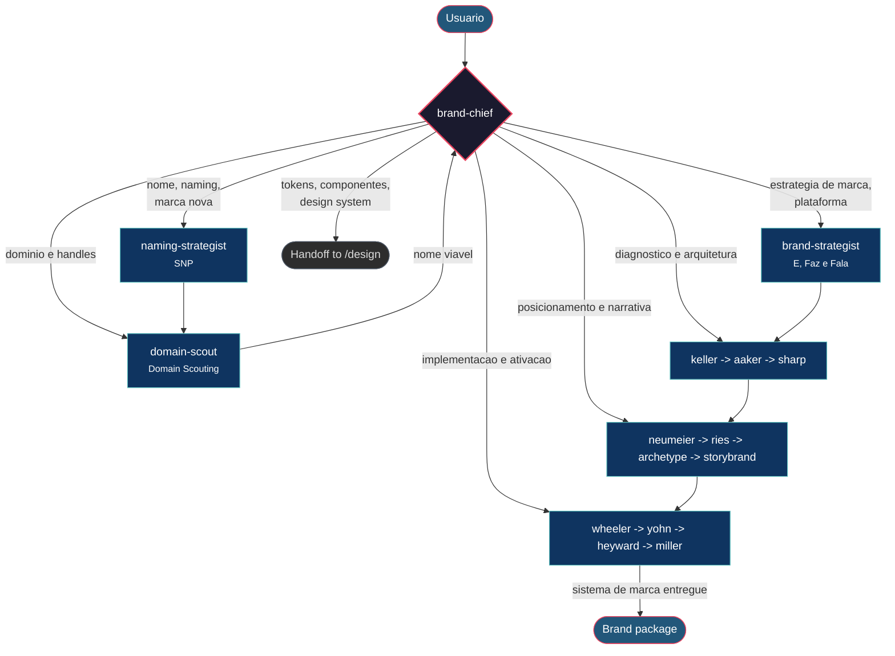

# Brand Squad - Governance Flow

## Overview

O Brand Squad opera com 15 agentes organizados em 5 camadas: orquestracao, core Brasil, foundations, positioning/narrative e activation. Todo request entra pelo **brand-chief**, que classifica a demanda, escolhe o workflow e controla os handoffs entre as fases.

---

## Flow

---

## Layers

### Layer 0 - Orchestration

| Agente | Papel | Nunca faz |
|--------|-------|-----------|
| **brand-chief** | Faz triagem, define workflow, decide profundidade e controla handoffs entre especialistas. | Executar o fluxo completo sozinho ou pular etapas por conveniencia |

### Layer 1 - Brasil Core

| Agente | Dominio | Entrega |
|--------|---------|---------|
| **naming-strategist** | Naming com metodologia SNP | Lista de nomes, funil e shortlist |
| **brand-strategist** | Estrategia de marca Brasil-first | Direcao de marca e plataforma base |
| **domain-scout** | Dominio, handles e custo | Viabilidade digital e disponibilidade |

### Layer 2 - Foundations

| Agente | Dominio | Entrega |
|--------|---------|---------|
| **keller-brand-equity** | Equity e diagnostico | Baseline de valor e percepcao |
| **aaker-brand-identity** | Arquitetura e identidade | Estrutura de marca |
| **sharp-brand-science** | Crescimento orientado por evidencia | Tese de crescimento e disponibilidade |

### Layer 3 - Positioning and Narrative

| Agente | Dominio | Entrega |
|--------|---------|---------|
| **neumeier-differentiation** | Diferenciacao radical | Onlyness e contraste competitivo |
| **ries-positioning** | Posicionamento | Posicao mental clara |
| **storybrand-narrator** | Narrativa comercial | Mensagem e estrutura SB7 |
| **archetype-consultant** | Simbolismo e consistencia | Arquetipo e coerencia simbolica |

### Layer 4 - Activation

| Agente | Dominio | Entrega |
|--------|---------|---------|
| **wheeler-brand-design** | Sistema de identidade | Guia de implementacao de marca |
| **yohn-brand-culture** | Cultura e marca | Alinhamento interno |
| **heyward-dtc-brand** | Startup/DTC | Escala de marca para crescimento |
| **miller-sticky-brand** | PME/B2B | Aplicacao pragmatica e diferenciacao comercial |

---

## Named Workflows

| Workflow | Quando usar | Caminho principal |
|----------|-------------|------------------|
| `wf-naming-to-domain` | Precisa definir nome e validar disponibilidade | naming-strategist -> domain-scout |
| `wf-brand-foundations` | Ja existe nome, mas falta base estrategica | keller -> aaker -> sharp |
| `wf-brand-positioning-narrative` | Falta diferenciar, posicionar e comunicar | neumeier -> ries -> archetype -> storybrand |
| `wf-brand-activation-system` | A marca ja existe e precisa virar sistema operacional | wheeler -> yohn -> heyward -> miller |
| `wf-brand-complete` | Criacao ou reposicionamento completo | naming/domain -> foundations -> positioning/narrative -> activation |
| `wf-brand-all-hands` | Diagnostico maximo com todos os especialistas | brand-chief orquestra todos os blocos |

---

## Handoffs

| De | Para | Quando |
|----|------|--------|
| **Qualquer agente** | brand-chief | A demanda saiu do escopo do especialista atual |
| brand-chief | `/design` | A demanda virou design system, tokens, componentes ou governanca visual reutilizavel |
| naming-strategist | domain-scout | Ha shortlist suficiente para validar dominio e handles |
| brand-strategist | keller-brand-equity | A direcao precisa de diagnostico de base |
| keller-brand-equity | aaker-brand-identity | O equity foi mapeado e precisa virar arquitetura |
| aaker-brand-identity | sharp-brand-science | A identidade esta clara e precisa de tese de crescimento |
| foundations | neumeier-differentiation | Os fundamentos estao definidos e falta diferenciar |
| neumeier-differentiation | ries-positioning | A tese de diferenciacao precisa ser traduzida em posicao competitiva |
| positioning | archetype-consultant | A posicao precisa de consistencia simbolica |
| archetype-consultant | storybrand-narrator | A identidade precisa virar narrativa de mensagem |
| narrative | wheeler-brand-design | A marca precisa virar sistema e implementacao |
| activation specialists | brand-chief | Surgiu conflito de escopo, sequenciamento ou prioridade |

---

## Scope Boundaries

O Brand Squad deve redirecionar:

| Request | Destino | Motivo |
|---------|---------|--------|
| Tokens, componentes, acessibilidade, design system, registry | `/design` | Isso pertence ao Design System Squad |
| Implementacao de produto, codigo de front-end, funcionalidades | Fora do escopo do Brand Squad | O foco aqui e estrategia e sistema de marca |
| Demanda apenas juridica, fiscal ou societaria | Fora do escopo | Nao faz parte do stack de marca deste squad |

Tudo que envolve **naming, arquitetura de marca, posicionamento, narrativa e ativacao** e IN_SCOPE.

---

## Performance Rules

- Sempre iniciar pelo **brand-chief** para escolher o menor workflow suficiente.
- Nao abrir `wf-brand-all-hands` sem motivo real; ele e fluxo de profundidade maxima.
- Fazer `wf-naming-to-domain` cedo quando o risco de disponibilidade puder invalidar o nome.
- So acionar `/design` quando a demanda realmente sair de estrategia para governanca visual sistemica.
- Tratar activation como fase final; nao pular foundations e positioning quando a base ainda estiver fraca.
