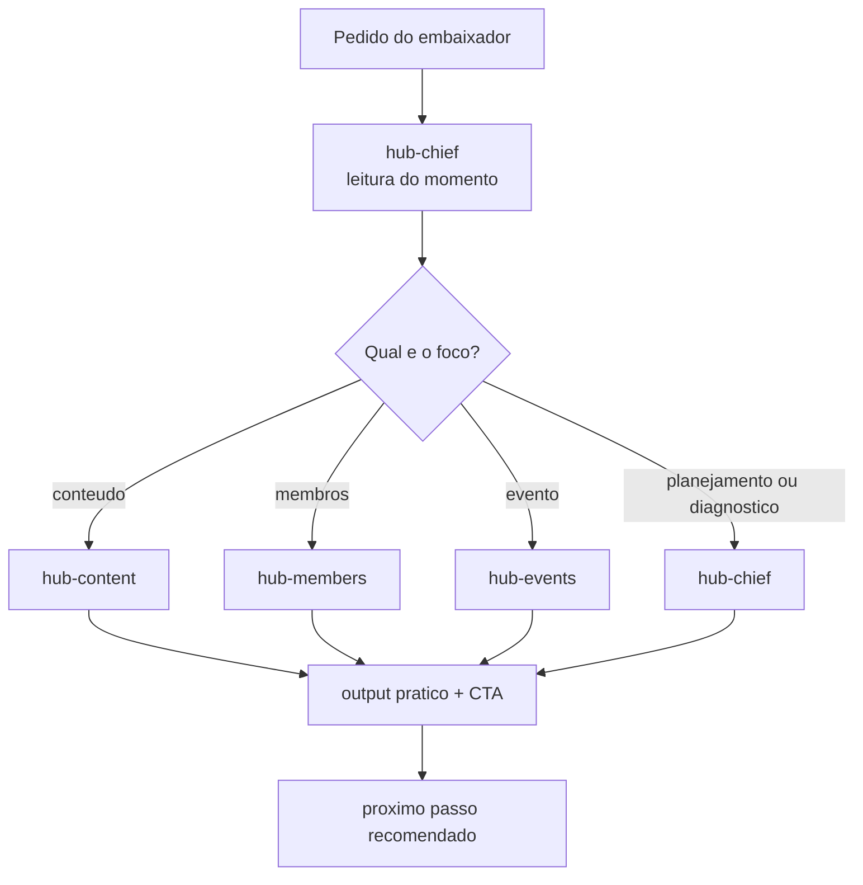

# Architecture — Hub Manager

## Visao geral

O `hub-manager` e um squad pipeline-leve com um orquestrador principal e tres especialistas operacionais.

- `hub-chief` recebe o pedido, diagnostica o momento e decide o fluxo
- `hub-content` cria mensagens, convites e CTAs
- `hub-members` cuida de onboarding e reativacao
- `hub-events` estrutura encontros, rituais e follow-up

## Fluxo base

## Workflows do MVP

- `weekly-operating-cycle`
- `event-launch-cycle`
- `member-reactivation-cycle`
- `hub-diagnostic-cycle`

## Fonte de verdade

`config.yaml` e a fonte canonica de configuracao do squad.

Os demais artefatos existem para uso humano, navegacao e execucao local do squad.
